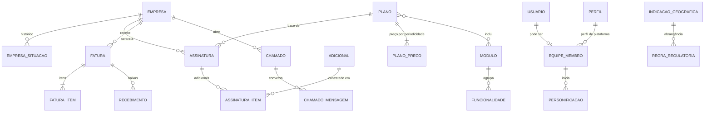
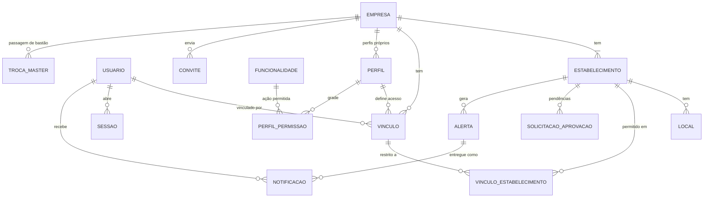
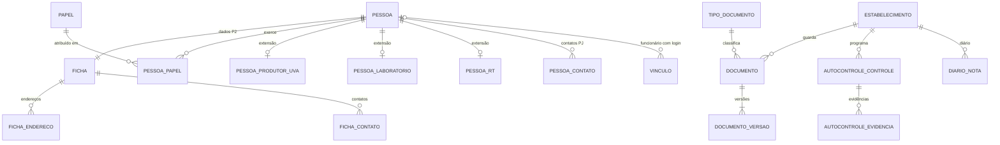
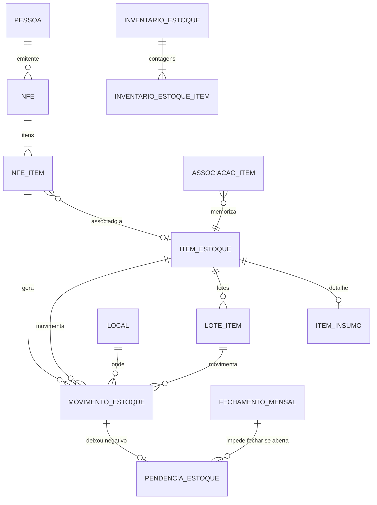
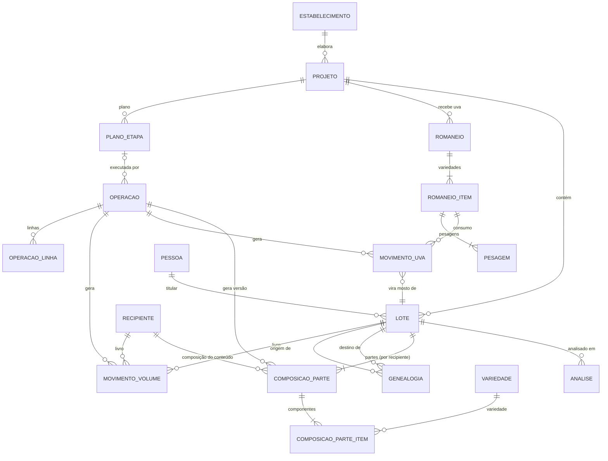
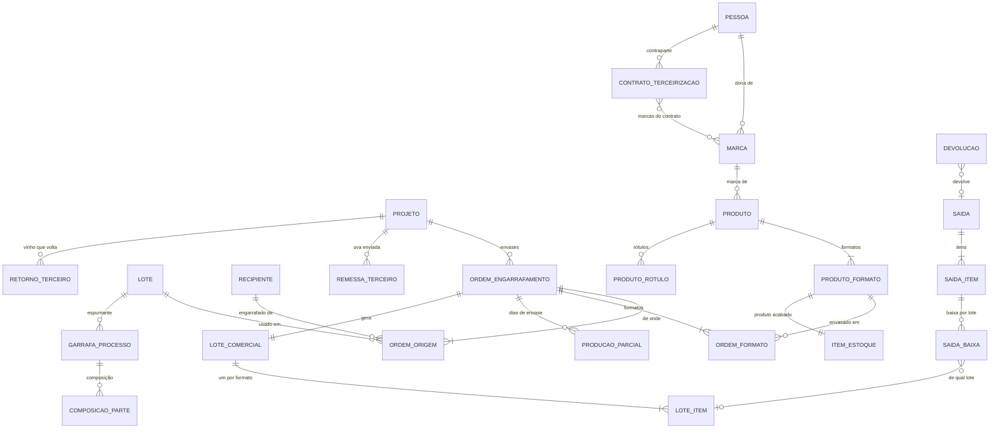
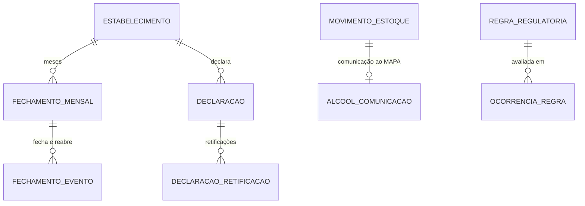

# Modelo de dados (conceitual)

> **Situação:** **aprovado pelo João Carlos em 03/10/2026**, com as decisões de modelagem da seção 6. Mudanças
> futuras seguem a regra da P1: o documento é atualizado na mesma entrega do código. As regras de negócio citadas vêm de documentos já decididos,
> e cada uma indica a origem.
> **Escopo:** Administração (plataforma), ambiente do cliente, Gestão e EnoTrace (cantina). VitiTrack, EnoTur e
> EnoMesa ficam de fora, salvo o mínimo de vinhedo que a recepção da uva exige.
> **Stack:** PostgreSQL + Node/TypeScript/Fastify/Drizzle ([decisoes/0001-stack.md](decisoes/0001-stack.md)).
> Este documento é conceitual: entidades, atributos principais, relacionamentos e regras. Não há DDL.
> **Fontes:** [01-premissas.md](01-premissas.md) (P1 a P29), [02-arquitetura.md](02-arquitetura.md),
> [modulos/administracao.md](modulos/administracao.md), [modulos/ambiente-cliente.md](modulos/ambiente-cliente.md),
> [modulos/gestao.md](modulos/gestao.md), [modulos/cantina.md](modulos/cantina.md), [FISCAL.md](FISCAL.md).

## Sumário

0. [Convenções](#0-convenções)
1. [Princípios transversais](#1-princípios-transversais)
2. [Entidades por área](#2-entidades-por-área)
3. [Diagramas](#3-diagramas)
4. [Como o volume é calculado](#4-como-o-volume-é-calculado)
5. [Como a composição e a genealogia são calculadas](#5-como-a-composição-e-a-genealogia-são-calculadas)
6. [Implementação](#implementação) e [Decisões de modelagem (03/10/2026)](#6-decisões-de-modelagem-03102026)
7. [Divergências encontradas entre documentos (Resolvidas em 03/10/2026)](#7-divergências-encontradas-entre-documentos-resolvidas-em-03102026)

---

## 0. Convenções

**Nomes.**
- Cada entidade tem um nome em português e um **nome técnico sugerido** em `snake_case`, sem acento, para o código.
- Os nomes técnicos são sugestão; mudam sem afetar as regras.

**Escopo de cada entidade** (marcado ao lado do nome):

| Marca | Significado |
|---|---|
| **Plat** | Da plataforma. Não pertence a nenhuma empresa |
| **Glob+** | Catálogo global com itens próprios da empresa (P8). Item com empresa vazia é global |
| **Emp** | Pertence a uma empresa (P12: cadastros compartilhados) |
| **Est** | Pertence a um estabelecimento (P12: recipientes, estoques, movimentos, declarações, documentos regulatórios) |
| **Usu** | Pertence ao usuário (identidade única, P8) |

**Tipos de dado conceituais:**

| Tipo | Regra | Origem |
|---|---|---|
| Identificador | UUID. Pode ser gerado no aparelho, o que permite o registro sem internet | cantina.md, Análises ("Uso sem internet") |
| Data-hora | Gravada em UTC; exibida no fuso do estabelecimento | P18 |
| Data | Data pura, sem hora | P18 |
| Moeda | Centavos inteiros | P3 |
| Litros, kg | Decimal de precisão fixa, 2 casas | P3 |
| Demais grandezas | Decimal fixo com as casas da P3 (densidade 4, SO₂ 1, pH 2…) | P3, P17 |
| Fração | Decimal de alta precisão (proposta: 8 casas) para a composição de cada recipiente; exibida em % com 2 casas | Seção 5 |
| Lista fechada | Valores fixos, com significado no código (ex.: situação de uma operação) | — |
| Lista configurável | Valores do catálogo de opções (global + próprios) | P8, P29 |

**Livro** = tabela somente-inclusão: só aceita novos lançamentos. Corrige-se por estorno (P13).

---

## 1. Princípios transversais

### 1.1 Visão geral

| Princípio | Premissa | Como aparece no modelo |
|---|---|---|
| Isolamento por empresa | P8, P12, P21; 02-arquitetura, Princípio 1 | Coluna `empresa_id` em toda tabela de empresa; política de segurança por linha (RLS) no banco; chaves estrangeiras que incluem a empresa |
| Escopo por estabelecimento | P12 | Coluna `estabelecimento_id` nas tabelas de nível Est; filtro pelo estabelecimento ativo e pelos permitidos no vínculo |
| Livro somente-inclusão e estorno | P13; 02-arquitetura, Princípio 2 | Tabelas de livro (volume, uva, estoque, garrafas em processo, auditoria) sem alteração nem exclusão; estorno = lançamentos inversos ligados ao original |
| Rascunho → confirmado → estornado | P13; cantina.md, Regras comuns das operações | Coluna de situação nos documentos de negócio; só o confirmado gera lançamentos no livro |
| Auditoria | P14, P28 | Tabela `auditoria`, gravada na mesma transação da mudança, com usuário real e personificado |
| Anexos | P15 | Tabela `anexo`, ligada a qualquer registro; arquivo fora do banco |
| Regras versionadas | P16, P29 | Tabela `regra_regulatoria` com vigência, abrangência e fonte; tabela `ocorrencia_regra` guarda cada alerta e o "ciente" |
| Numeração | P19 | Tabela `sequencia`, travada na confirmação (o rascunho não tem número); tabela `formato_codigo` por empresa |
| Inativar em vez de apagar | P26 | Colunas de inativação nos cadastros; exclusão física só sem vínculo ou pela limpeza (P7) |
| Identidade única e vínculos | P8, P10, P27, P28 | `usuario` sem empresa, único por e-mail; `vinculo` liga o usuário a cada empresa com um perfil |
| Catálogos globais com itens próprios | P8 | Mesma tabela para o global e o próprio; empresa vazia = global |
| Bloco cadastral padrão | P2 | Entidade `ficha` reutilizada por empresa, estabelecimento, pessoa e usuário |
| Plano e módulos | P25, P27 | Cada funcionalidade pertence a um módulo; a permissão só vale se o módulo estiver contratado |
| Período fechado | P13; cantina.md, Declarações e fechamento | `fechamento_mensal` por estabelecimento; nenhum lançamento entra em mês fechado |
| Datas e precisão | P3, P17, P18 | Tipos conceituais da seção 0 |
| Importação e carga inicial | P23; cantina.md, Carga inicial | `importacao` registra cada carga; os registros gerados apontam para ela e ficam marcados como "carga inicial" |

### 1.2 Isolamento por empresa e escopo por estabelecimento

- **Toda tabela de empresa tem `empresa_id` obrigatório.**
  - No banco, a política de segurança por linha só mostra as linhas da empresa ativa na requisição (02-arquitetura, Princípio 1).
  - A API conecta com um usuário do banco que não ignora essas políticas.
- **Referências sempre dentro da mesma empresa.** As chaves estrangeiras entre tabelas de empresa incluem `empresa_id`. Assim, um lote nunca aponta para o recipiente de outra empresa, nem por erro de programa.
- **Tabelas de estabelecimento** têm também `estabelecimento_id`.
  - A API filtra pelo estabelecimento ativo.
  - Se o vínculo do usuário for restrito a alguns estabelecimentos, a API recusa os demais (P12).
  - A visão "Todos" soma só os estabelecimentos permitidos (ambiente-cliente.md, Barra superior).
- **Tabelas da plataforma** (planos, faturas, catálogos, regras) não têm empresa.
  - O acesso é decidido pelo perfil de plataforma (P27).
  - **Proposta técnica:** a API marca a requisição como "plataforma" depois de conferir o perfil, e as políticas do banco aceitam essa marca. Assim, a consulta global de auditoria não exige um usuário de banco sem restrição.
- **Catálogos Glob+:** a política mostra as linhas globais (empresa vazia) mais as da empresa ativa. A empresa nunca grava em linha global (P8).

### 1.3 Livro somente-inclusão, estorno e ciclo de vida

- **Livros do modelo:**

  | Livro | O que registra |
  |---|---|
  | `movimento_volume` | Litros que entram e saem de recipientes, por lote (seção 4) |
  | `movimento_uva` | Kg de uva do romaneio consumidos no processamento |
  | `movimento_estoque` | Entradas e saídas de itens de estoque, por lote de item e local |
  | `espumante_evento` | Estágios das garrafas de espumante em processo (perdas e insumos; anulável com motivo) |
  | `auditoria` | Tudo o que acontece no sistema (P14) |
  | `evento_integracao` | Avisos recebidos de provedores (pagamento, envios) |

- **No banco:** o usuário da API só tem permissão de **inserir e ler** essas tabelas (02-arquitetura, Princípio 2).
- **Estorno:** é um novo registro, com motivo obrigatório. Ele gera os lançamentos inversos e aponta para o original (`estorno_de`). O estorno também é imutável (P13).
  - Os lançamentos inversos levam a **data de execução da operação original**. Se esse mês estiver fechado, o estorno exige reabri-lo (P13), e a reabertura fica auditada. Assim o relatório do mês fica certo (Decidido em 03/10/2026, seção 6).
- **Ciclo de vida dos documentos de negócio** (operação, romaneio, saída, ordem de engarrafamento, importação de NF-e):

  | Situação | Efeito no livro | Pode editar? |
  |---|---|---|
  | Rascunho | Nenhum. Não entra em relatórios nem declarações | Sim. Pode ser descartado |
  | Aguardando aprovação | Nenhum | Não. Aguarda decisão (P27) |
  | Confirmado | Lançamentos gravados | Não. Só estorno |
  | Estornado | Lançamentos inversos gravados | Não |

  Fontes: P13; cantina.md, Regras comuns das operações; P27, Fluxo de aprovação.

### 1.4 Colunas comuns

| Grupo | Colunas | Onde |
|---|---|---|
| Identidade | `id` (UUID) | Todas |
| Isolamento | `empresa_id`, `estabelecimento_id` | Conforme o escopo (seção 0) |
| Criação | `criado_em`, `criado_por` | Todas |
| Alteração | `atualizado_em`, `atualizado_por`, `versao` (controle de edição simultânea) | Cadastros e rascunhos. Livros não têm |
| Inativação (P26) | `ativo`, `inativado_em`, `inativado_por`, `motivo_inativacao` | Cadastros |
| Situação (P13) | `situacao`, `confirmado_em`, `confirmado_por`, `estorno_de`, `motivo_estorno` | Documentos de negócio |
| Datas da cantina | `executado_em` (informada), `lancado_em` (do sistema) | Operações e livros (cantina.md, "Duas datas") |
| Origem do dado | `origem` (manual, importação de XML, planilha, carga inicial, automática), `importacao_id` | Registros que podem vir de carga (P23) |

### 1.5 Auditoria (P14, P28)

- **Um registro por ação**, gravado na mesma transação da mudança. Se a mudança falhar, a auditoria também não fica.
- **Campos:** data-hora; usuário real; usuário personificado e personificação, quando houver; empresa e estabelecimento; ação; entidade e identificador; diferença antes/depois por campo; motivo; IP, navegador e identificador da requisição (P14).
- **Também entram:** login, logout e falhas; troca de senha; troca de empresa ou estabelecimento ativo; acessos negados; exportações, limpezas, reaberturas, mudanças de perfil e personificações (P14).
- **Guarda de 5 anos** (P14). Proposta técnica: tabela particionada por mês, para arquivar sem apagar.
- A aba **Histórico** de cada registro é uma consulta à auditoria filtrada por entidade e identificador.

### 1.6 Anexos (P15)

- Um anexo pertence a **um registro** (entidade + identificador) e a uma **categoria**.
- O arquivo fica no armazenamento de arquivos, no caminho `empresa/estabelecimento/entidade/registro/arquivo`. O banco guarda só os metadados (P15).
- O **hash** detecta duplicidade e corrupção (P15).
- O espaço usado por empresa é a soma dos tamanhos; serve ao limite do plano (P25).

### 1.7 Regras versionadas e o cliente decide (P16, P29)

- **Uma regra** = tipo + chave (ex.: "SO₂ total máximo") + abrangência (nacional, UF ou IG) + vigência + valor + fonte legal.
- **Uma norma nova vira nova versão**, sem apagar a anterior (P16).
- **Aplicação no tempo:** o registro é avaliado pela versão vigente na data dele (P16). Um laudo de 2025 segue a regra de 2025.
- **Três níveis da P29 no modelo:**

  | Nível | Onde fica | O que acontece |
  |---|---|---|
  | Impossibilidade física e integridade | Regras fixas no código (seção 4) | Bloqueia |
  | Limite legal | `regra_regulatoria` | Gera uma `ocorrencia_regra`. Para confirmar, o usuário marca "ciente". Se a empresa transformou o alerta em bloqueio (`regra_bloqueio`), só o Master desbloqueia, com motivo |
  | Prática de vinificação | Opções e parâmetros da empresa | Livre. O sistema só registra |

### 1.8 Numeração (P19)

- **Sequência** por estabelecimento, tipo de registro e ano (P19). Na fatura, a sequência é da plataforma (administracao.md, Faturas).
  - **Lote de produção:** a sequência é **por safra**; os dois ciclos compartilham a série, seguindo a P19 ("por ano"). Ex.: `2026.01-042` e `2026.02-043`.
- **Número na confirmação.** O número é tomado **dentro da transação de confirmação**, com a linha da sequência travada. Assim não há buraco nem repetição, mesmo com rascunhos descartados.
  - O rascunho usa um **identificador provisório** (ex.: "Rascunho 12"), inclusive o romaneio aberto na balança. O código definitivo sai ao confirmar.
- **Código do lote de produção** (`AAAA.CC-NNN`): leva a **safra e o ciclo com mais litros** na composição com que o lote nasce; em empate, o mais recente. O código é técnico e não muda depois; a composição real aparece ao lado (cantina.md, Variedade fora do código).
- **Formato** configurável por empresa (`formato_codigo`). Mudar o formato vale só para números novos.

### 1.9 Inativar em vez de apagar (P26)

- Cadastros referenciados (pessoa, item, recipiente, perfil, local, catálogo) só são **inativados**.
- Um item inativo continua aparecendo nos registros antigos, mas não é oferecido em registros novos.
- A **exclusão física** só existe para registros sem vínculo e na limpeza administrativa (P7), que respeita as dependências e deixa auditoria.

### 1.10 Identidade única e vínculos (P8)

- **Usuário:** único no sistema, identificado pelo e-mail. Não pertence a nenhuma empresa.
- **Vínculo:** usuário + empresa + perfil, opcionalmente restrito a estabelecimentos (P12, P27).
- **Equipe da plataforma:** o mesmo usuário pode ter um registro de membro da equipe, com perfil de plataforma (P8, P27).
- **Funcionário com login:** o vínculo aponta para a pessoa (papel funcionário) da empresa. Assim, a mesma pessoa aparece em "executado por" e como usuário (gestao.md, Funcionário e usuário).
- **Dados pessoais do usuário** ficam na ficha dele (P10), separados da ficha da pessoa na empresa. A empresa A não vê o que o usuário mantém para a empresa B.

### 1.11 Catálogos globais com itens próprios (P8)

- **Mesma tabela** para o global e o próprio: coluna `empresa_id` vazia = item global.
- A plataforma mantém os globais. A empresa cria os seus, visíveis só para ela, e nunca altera um global (P8; administracao.md, Catálogos globais).
- **Item global em uso** é inativado, não apagado (administracao.md, Catálogos globais).
- **Exceções** em que a empresa não cria itens próprios:
  - **papéis de pessoa**: só a plataforma cria (gestao.md, Pessoas);
  - **unidades** e **classes oficiais de produto**, que são oficiais.
- **Variedades:** a empresa associa as globais com que trabalha e pode criar as suas (clone local, nome regional), marcadas **"sem código oficial"**. A plataforma é avisada para avaliar a inclusão no catálogo global, e as declarações mostram alerta (ambiente-cliente.md, Cadastros).
- **Listas simples** (motivos de perda, métodos de trasfega, frações de prensa, tipos de saída, etapas de produção, cargos…) ficam numa só entidade, `opcao_lista`, separadas pelo nome da lista.

### 1.12 Bloco cadastral padrão (P2)

- **Ficha** (`ficha`): tipo de pessoa, nome, documento, inscrições, site, avatar e observações.
- **Filhos da ficha:** endereços e contatos (e-mails, telefones, redes).
- Empresa, estabelecimento, pessoa e usuário apontam cada um para **uma** ficha. Um só conjunto de validações e componentes de tela (P2).
- **Unicidade do documento** é conferida no dono: na pessoa, por empresa (gestao.md, Pessoas); na empresa, na plataforma inteira, porque o documento identifica o contrato (ambiente-cliente.md, Documento do cliente).

### 1.13 Entidades transversais

| Entidade | Finalidade | Atributos principais | Relacionamentos | Regras e invariantes |
|---|---|---|---|---|
| **Ficha cadastral** `ficha` · Emp ou Usu | Bloco padrão de cadastro (P2) | Tipo (física, jurídica, estrangeira); nome ou razão social; nome fantasia; tipo e número do documento; país (estrangeiro); IE e IM (aceitam "Isento"); site; avatar; observações | 1:N endereço e contato. Usada 1:1 por empresa, estabelecimento, pessoa e usuário | CPF/CNPJ com dígitos verificadores; CNPJ alfanumérico aceito (P2; IN RFB 2.229/2024, a confirmar) |
| **Endereço** `ficha_endereco` | Endereços da ficha | Rótulo (principal, cobrança, entrega, propriedade rural); CEP; logradouro; número; complemento; bairro; município com código IBGE; UF; principal | N:1 ficha | Um principal por ficha. O código IBGE alimenta regras por UF e IG (00-visao-geral.md, Perfil da vinícola) |
| **Contato** `ficha_contato` | E-mails, telefones e redes | Tipo (e-mail, telefone, rede); rótulo; valor; WhatsApp (telefone); rede (Instagram, Facebook…); principal | N:1 ficha | Formato validado; um e-mail principal (P2) |
| **Registro de auditoria** `auditoria` · Emp ou Plat | Rastro de tudo (P14) | Ver 1.5 | N:1 usuário, empresa, personificação | Somente inclusão; guarda de 5 anos (P14) |
| **Anexo** `anexo` · Emp | Arquivos de qualquer registro (P15) | Entidade e identificador do registro; categoria (laudo, nota fiscal, certificado, foto, rótulo, comprovante, outro); nome original; tipo; tamanho; hash; caminho; enviado por e em | N:1 registro de qualquer entidade | Caminho previsível (P15). Remoção só inativa e fica na auditoria (P14, P26) |
| **Sequência** `sequencia` · Est ou Plat | Próximo número de cada série (P19) | Estabelecimento; tipo de registro; período (ano; no lote de produção, a safra); último número | 1:N registros numerados | Incremento só na confirmação, com a linha travada; rascunho sem número (1.8) |
| **Formato de código** `formato_codigo` · Emp | Máscara de cada código (P19) | Tipo de registro; máscara (ex.: `ROM-{AAAA}-{NNNN}`) | — | Padrões em cantina.md, Códigos |
| **Importação de planilha** `importacao` · Est | Cada carga por planilha (P23) | Tipo (cadastro, saldo de abertura, movimentos, resultados de laudo); arquivo (anexo); quem; quando; linhas; erros por linha; situação (validada, aplicada, estornada); é carga inicial | 1:N registros gerados | Tudo ou nada. Estorno só se não houver movimentos dependentes (P23) |
| **Ocorrência de regra** `ocorrencia_regra` · Est | Cada alerta legal em um registro (P29) | Registro avaliado (entidade e identificador); versão da regra; valor apurado; limite; resultado (alerta ou bloqueio); "ciente" por e em; desbloqueio pelo Master (por, em, motivo); situação (pendente, ciente, desbloqueada) | N:1 regra regulatória, usuário | Sem "ciente", o registro não confirma. Com bloqueio, só o Master libera, com motivo (P29) |
| **Preferência de listagem** `preferencia_listagem` · Usu | Última ordenação, filtros e tamanho de página (P4) | Usuário; empresa; tabela; ordenação; filtros; tamanho de página | N:1 usuário | Por usuário e por tabela (P4) |
| **Opção de lista** `opcao_lista` · Glob+ | Listas simples configuráveis (P29) | Nome da lista; código; nome; ordem; empresa (vazia = global); dados extras (ex.: método de espumante de um estágio) | Usada por várias entidades | Global não é editado pela empresa (P8). Inativar, não apagar (P26) |

---

## 2. Entidades por área

### 2.1 Plataforma

Área da equipe do ViniCycle (administracao.md).

**Clientes, planos e assinaturas**

| Entidade | Finalidade | Atributos principais | Relacionamentos | Regras e invariantes |
|---|---|---|---|---|
| **Empresa** `empresa` · Plat (raiz da empresa) | O cliente que assina (P12) | Ficha P2; situação atual (teste, ativo, somente leitura, bloqueado, inativo); moeda; logo e cor de marca dos impressos (P9); contato financeiro (nome, e-mail, telefone); regime tributário (guardado; uso só na fase fiscal, FISCAL.md) | 1:1 ficha; 1:N estabelecimento, vínculo, assinatura, fatura, perfil | Documento único na plataforma; o Master não o altera, só o suporte (ambiente-cliente.md, Documento do cliente). Exatamente um Master ativo (P27). Sem estabelecimento, todo login cai na criação de estabelecimento (administracao.md, Fluxo, passo 4) |
| **Situação da empresa** `empresa_situacao` · Plat | Histórico de situações | Situação; desde; até; motivo; origem (teste, régua de inadimplência, manual) | N:1 empresa | Somente inclusão. Bloqueio manual exige motivo (administracao.md, Inadimplência e bloqueio) |
| **Módulo** `modulo` · Plat | Módulos do produto | Código (Gestão, EnoTrace, VitiTrack, EnoTur, EnoMesa); nome; função; situação (disponível, em breve) | N:N plano; 1:N funcionalidade | Gestão está em todos os planos (ambiente-cliente.md, Módulos) |
| **Funcionalidade** `funcionalidade` · Plat | Telas e funcionalidades da grade (P27) | Código; nome; módulo; ações aplicáveis (visualizar, criar, editar, inativar, confirmar, estornar, exportar, importar, reabrir período, aprovar) | N:1 módulo; 1:N permissão do perfil | Mantida pelo sistema. Só vale se o módulo estiver contratado (P25, P27) |
| **Plano** `plano` · Plat | O que se vende (P25) | Nome; descrição; situação; limites (estabelecimentos, usuários, GB de anexos); formas de pagamento aceitas | N:N módulo (`plano_modulo`); 1:N preço, assinatura | Plano inativo não é vendido; assinaturas seguem (administracao.md, Planos) |
| **Preço do plano** `plano_preco` · Plat | Preço por periodicidade | Periodicidade (mensal, trimestral, semestral, anual); valor; vigência | N:1 plano | Mudar o preço não muda assinaturas em vigor (P25) |
| **Adicional** `adicional` · Plat | Itens vendidos à parte (P25) | Nome; tipo (usuário, estabelecimento, armazenamento, módulo); módulo, se for o caso; preço por unidade; periodicidade | 1:N item da assinatura | — |
| **Assinatura** `assinatura` · Plat | Contrato da empresa | Empresa; plano; periodicidade; preço contratado; início e fim da vigência; ciclo atual (início e fim); dia-base do ciclo; dia de vencimento; forma de pagamento; em teste e fim do teste; situação | N:1 empresa, plano; 1:N item, mudança, fatura | Uma assinatura vigente por empresa. Preço congelado (P25). Teste de 7 dias (administracao.md, Período de teste). O dia-base faz o ciclo que começa no dia 31 voltar ao 31 depois dos meses curtos (ciclo 11) |
| **Item da assinatura** `assinatura_item` · Plat | Adicionais contratados | Adicional; quantidade; quantidade por unidade e preço congelados; início; fim | N:1 assinatura, adicional | Limite efetivo = plano + adicionais (P25) |
| **Mudança de assinatura** `assinatura_mudanca` · Plat | Upgrade, downgrade e retirada de adicional | Tipo; plano ou adicional novo; quantidade; data de efeito; situação (agendada, aplicada, cancelada); valor proporcional | N:1 assinatura | Upgrade vale na hora, com proporcional na próxima fatura. Downgrade só na renovação, sem reembolso (administracao.md, Planos) |
| **Desconto** `desconto` · Plat | Condição especial por cliente | Empresa; valor ou percentual; motivo; validade | N:1 empresa ou assinatura | Motivo obrigatório (administracao.md, Planos) |

**Faturas e integrações**

| Entidade | Finalidade | Atributos principais | Relacionamentos | Regras e invariantes |
|---|---|---|---|---|
| **Fatura** `fatura` · Plat | Cobrança de um ciclo | Número (sequência da plataforma); empresa; competência; vencimento; total; situação (aberta, paga, parcial, vencida, cancelada) | N:1 empresa, assinatura; 1:N item, recebimento | Paga quando a soma dos recebimentos atinge o total (administracao.md, Faturas). Gerada a cada ciclo |
| **Item da fatura** `fatura_item` · Plat | Linhas da fatura | Descrição; origem (plano, adicional, proporcional, desconto); quantidade; valor | N:1 fatura | — |
| **Recebimento** `recebimento` · Plat | Baixa de pagamento | Data; valor; forma (PIX, boleto, cartão de crédito, cartão de débito, transferência, dinheiro); referência; comprovante (anexo); origem (manual ou provedor); estorno (quando, quem, motivo) | N:1 fatura; N:1 evento de integração | Baixa manual sempre disponível. Pagamento desbloqueia na hora (administracao.md, Inadimplência) |
| **Integração da plataforma** `integracao` · Plat | Provedores plugáveis | Tipo (pagamento, e-mail, WhatsApp, SMS, busca de CEP e CNPJ); adaptador; formas atendidas; credenciais cifradas; ativo | 1:N evento de integração, envio | Segredos cifrados (P21). Mais de um provedor ao mesmo tempo (administracao.md, Integração de pagamentos, proposta) |
| **Evento de integração** `evento_integracao` · Plat | Avisos recebidos (webhooks) | Integração; identificador externo; tipo padrão (pago, vencido, estornado, recusado…); conteúdo; assinatura verificada; processado em | N:1 integração | Somente inclusão. Idempotente: identificador externo único, então o aviso repetido não baixa duas vezes (administracao.md, Integração de pagamentos) |
| **Cliente no provedor** `cliente_provedor` · Plat | A empresa como cliente no provedor de pagamento | Empresa; integração; identificador externo | N:1 empresa, integração | Um por empresa e integração (ciclo 12) |
| **Cobrança externa** `cobranca_externa` · Emp | A cobrança da fatura no provedor | Fatura; integração; forma; identificador externo; link de pagamento; PIX copia e cola; situação (pendente, ativa, paga, cancelar, cancelada, erro); tentativas | N:1 fatura, integração | Uma válida por fatura; fatura cancelada ou paga por fora cancela no provedor (ciclo 12) |
| **Nota de serviço** `nota_servico` · Emp | NFS-e da fatura, emitida pelo provedor | Fatura; integração; identificador externo; número; situação; PDF e XML | N:1 fatura | Pedida depois do pagamento; atualizada pelo aviso do provedor (pendência 25; ciclo 12) |

**Equipe, catálogos e regras**

| Entidade | Finalidade | Atributos principais | Relacionamentos | Regras e invariantes |
|---|---|---|---|---|
| **Membro da equipe** `equipe_membro` · Plat | Quem é da equipe da plataforma (P8) | Usuário; perfil de plataforma; situação; concedido por; concedido em | N:1 usuário, perfil | Só um administrador geral concede; auditado (P8). Segundo fator obrigatório (P21) |
| *Perfil de plataforma e perfil-modelo* | — | — | — | São registros da entidade **Perfil** (2.2), com escopo "plataforma" ou "modelo" |
| **Variedade** `variedade` · Glob+ | Catálogo de cultivares: o oficial, da plataforma, e as variedades próprias de cada cliente | Nome; código oficial (vazio no item próprio, exibido como **"sem código oficial"**); tipo (vinífera, americana ou híbrida); cor (tinta, branca, rosada); sinônimos; empresa (vazia = global); avisada à plataforma em; equivale a (variedade global, se a plataforma a incluir depois; Proposta) | 1:N variedade da empresa, item do romaneio, parcela, componente da composição | O global é mantido pela plataforma e versionado (P16, "cultivares oficiais"). O cliente cria a sua para cultivar fora do catálogo (clone local, nome regional); a plataforma é avisada para avaliar a inclusão, e as declarações (anual e apoio ao SIVIBE) mostram alerta quando há variedade sem código oficial (ambiente-cliente.md, Cadastros, Decidido em 03/10/2026). Item próprio em uso é inativado, não apagado (P26) |
| **Classe de produto** `classe_produto` · Plat | Classificação oficial (fino, nobre, espumante, suco, de mesa, colonial…) | Nome; categoria; exige método de espumante; vigência; fonte legal | 1:N produto, projeto | Versionada (P16, "classificações oficiais") |
| **Unidade** `unidade` · Plat | Catálogo único de unidades (P17) | Símbolo; nome; grandeza; casas decimais | 1:N conversão | Precisão fixa por grandeza (P3) |
| **Conversão de unidade** `unidade_conversao` · Plat | Conversões entre unidades | De; para; fórmula ou fator; vigência; fonte | N:1 unidade | Fórmulas em tabela versionada (cantina.md, Laboratório, Unidades) |
| **Tipo de insumo** `tipo_insumo` · Glob+ | Leveduras, acidificantes, clarificantes… | Nome; unidades permitidas; apresentações permitidas | 1:N item de insumo | Restringe unidades e apresentações (ambiente-cliente.md, Cadastros) |
| **Insumo de referência** `insumo_referencia` · Plat | Aditivos e coadjuvantes comuns | Nome; tipo; código de limite legal (aponta para regras) | 1:N item de insumo; regras | Limites são regras versionadas (P16) |
| **Tipo de recipiente** `tipo_recipiente` · Glob+ | Tanque inox, barrica, autoclave… | Nome; pressurizado; é barrica (habilita campos de barrica) | 1:N recipiente | — |
| **Tipo de documento** `tipo_documento` · Glob+ | Registro MAPA, ART, licença, AVCB… | Nome; tem vencimento; avisos padrão (60, 30, 7 dias) | 1:N documento | Avisos configuráveis por tipo (gestao.md, Documentos) |
| **Parâmetro de análise** `parametro_analise` · Glob+ | Densidade, pH, SO₂ livre, açúcares totais… | Nome; unidade padrão; unidades aceitas; casas; mínimo e máximo físicos | 1:N resultado, faixa ideal | Valor guardado na unidade padrão (cantina.md, Laboratório) |
| **Papel** `papel` · Plat | Papéis de pessoa | Código; nome; tem extensão | 1:N papel da pessoa | Só a plataforma cria (gestao.md, Pessoas) |
| **Tipo de alerta** `tipo_alerta` · Plat | Alertas da central (P20) | Código; nome; módulo; antecedência padrão; destinatário padrão | 1:N alerta, configuração de notificação | Lista da P20 |
| **Indicação geográfica** `indicacao_geografica` · Plat | IPs e DOs (ex.: IP Vale do São Francisco) | Nome; tipo (IP, DO); municípios (código IBGE); entidade gestora | 1:N regras; N:N estabelecimento | Regras da IG são regras versionadas (P16) |
| **Modelo de autocontrole** (lista no código, `MODELO_AUTOCONTROLE` em `packages/shared`) · Plat | Controles da norma | Código; nome; descrição com a fonte; periodicidade sugerida; evidência automática | Copiado para o controle de autocontrole ("Criar o programa pelo modelo") | Decreto 12.709/2025, arts. 117 a 120 (gestao.md, Autocontrole). Sem tabela: muda com a versão do sistema (decidido no ciclo 8, 04/10/2026) |
| **Regra regulatória** `regra_regulatoria` · Plat | Limites, faixas, prazos e dizeres (P16) | Tipo; chave; abrangência (nacional, UF, IG) e código; vigência (início, fim); valor (mínimo, máximo, unidade, dados extras); comportamento padrão (alerta); fonte legal (norma, artigo, link, nota) | N:1 IG; 1:N ocorrência | Sem sobreposição de vigência para a mesma chave e abrangência. Nova norma = nova versão (P16) |

**Termos, suporte, mensagens e manutenção**

| Entidade | Finalidade | Atributos principais | Relacionamentos | Regras e invariantes |
|---|---|---|---|---|
| **Versão de termo** `termo_versao` · Plat | Termos de uso e política de privacidade | Tipo; versão; texto; vigente a partir de | 1:N aceite | Versionados (P21) |
| **Aceite de termo** `termo_aceite` · Usu | Aceite datado | Usuário; versão; data-hora; IP | N:1 usuário, versão | Somente inclusão (P21) |
| **Chamado** `chamado` · Emp | Pedido de suporte | Número (sequência da plataforma); empresa (vazia na página pública sem cliente achado); solicitante (usuário, ou nome, e-mail e documento na página pública); origem; assunto; categoria; prioridade; situação; prazo e data da primeira resposta; encerramento | 1:N mensagem, histórico; anexos | Avisos para a equipe e para o cliente (administracao.md, Suporte) |
| **Mensagem do chamado** `chamado_mensagem` · Emp | Conversa | Autor (cliente ou equipe); texto; nota interna (só a equipe vê); data-hora; anexos | N:1 chamado | Somente inclusão |
| **Mudança de situação do chamado** `chamado_historico` · Emp | Histórico | De; para; por; quando | N:1 chamado | Somente inclusão |
| **Prazo de atendimento** `chamado_prazo` · Plat | SLA | Plano ou empresa; prioridade; horas (sem exceção, vale o padrão: urgente 4, alta 8, normal 24, baixa 72 h) | — | Semáforo do tempo de espera (administracao.md, Suporte). Categorias e situações (com cor) ficam em listas da plataforma |
| **Envio** `envio` · Plat | Fila de e-mail, WhatsApp e SMS | Canal; destinatário; modelo e versão; conteúdo final; origem (notificação, convite, fatura…); situação (pendente, enviado, falhou); tentativas; último erro; provedor | N:1 integração, modelo; 1:N tentativa | Reenvio pela Administração (administracao.md, Mapa de telas) |
| **Tentativa de envio** `envio_tentativa` · Plat | Cada tentativa | Data-hora; resultado; resposta do provedor | N:1 envio | Somente inclusão |
| **Versão do modelo** `modelo_mensagem_versao` · Plat | Textos editados (convite e avisos de cobrança) | Código do modelo; assunto; corpo com variáveis; versão; ativa | — | Uma ativa por código; sem versão ativa vale o texto padrão do sistema. Os modelos editáveis são uma lista no código (`MODELOS_EDITAVEIS`), não uma tabela (ciclo 12) |
| **Configuração da plataforma** `config_plataforma` · Plat | Parâmetros gerais | Dados da empresa dona; prazos (convite 7 dias, bastão 48 h, teste 7 dias, tolerância 5 dias, somente leitura 15 dias, fatura 10 dias antes do vencimento); avisos do teste (D-3, D-1) e do vencimento (D-3, no dia) | — | Valores de administracao.md; editáveis em Administração › Configurações (ciclo 11) |
| **Aviso de cobrança** `aviso_cobranca` · Plat | Avisos da régua já enviados | Empresa; tipo; fatura ou assinatura; chave (ex.: D-3); quando | N:1 empresa | Cada aviso sai uma vez (ciclo 11) |
| **Interesse em módulo** `interesse_modulo` · Emp | Vitrine "Conheça e contrate" | Empresa; módulo; usuário; observação; data; atendido em e por | N:1 empresa, módulo | Chega à plataforma como oportunidade (ambiente-cliente.md, Módulos) |
| **Personificação** `personificacao` · Plat | Sessão de suporte como cliente (P28) | Membro da equipe e usuário personificado (com os nomes guardados no início); empresa; motivo; chamado; início; fim previsto (60 min); fim; forma de encerramento (manual, tempo, saída) | N:1 membro, usuário, empresa, chamado | Máximo de 60 min (proposta P28). Aviso ao Master. Ações bloqueadas na P28 |
| **Limpeza de dados** `limpeza` · Plat | Execução da P7 | Escopo (tabela, empresa, tudo); prévia com contagens; frase digitada; executor; exportação prévia; executada em | N:1 exportação | Confirmação reforçada e auditoria (P7). Aviso de guarda legal (Decreto 12.709/2025, art. 123) |
| **Exportação de dados** `exportacao` · Emp | Pacote completo (P15) | Empresa; solicitante; tipo (completa, titular LGPD, antes de limpeza); arquivo; situação; validade do link | N:1 empresa | Só o Master pede a completa (ambiente-cliente.md, Configurações) |

### 2.2 Empresa e acesso

| Entidade | Finalidade | Atributos principais | Relacionamentos | Regras e invariantes |
|---|---|---|---|---|
| **Estabelecimento** `estabelecimento` · Emp | Unidade com CNPJ e registro MAPA (P12) | Ficha P2 (CNPJ, IE); registro MAPA e validade; responsável técnico (pessoa); capacidade de armazenamento; fuso; **perfil**: origem da uva (própria, comprada, ambas), atividades MAPA, produtos elaborados (classes), autocontrole (tem Manual de BPF, última revisão), forma atual de registro; situação | N:1 empresa; N:N IG; 1:N local, recipiente, projeto, documento | Quantidade limitada pelo plano (P25). Inativar, não apagar (P26). O perfil liga e desliga regras (00-visao-geral.md, Perfil da vinícola) |
| **IG do estabelecimento** `estabelecimento_ig` · Est | IGs usadas | Estabelecimento; IG; desde | N:1 estabelecimento, IG | Liga os controles da IG (00-visao-geral.md, Perfil) |
| **Local** `local` · Est | Onde ficam recipientes e estoques | Nome; uso (recipientes, estoque, ambos); módulo do estoque; refrigerado; externo (cantina de terceiro); situação | N:1 estabelecimento; 1:N recipiente, movimento de estoque | Um só cadastro de locais (gestao.md, Parâmetros, "Locais"). Mais de um local por módulo (ambiente-cliente.md, Estoque) |
| **Usuário** `usuario` · Usu | Identidade única (P8) | E-mail (único, sem diferenciar maiúsculas); ficha P2 própria; senha (hash); segundo fator (segredo cifrado); preferências (tema, paleta, idioma, formato de data, canais de notificação); situação; tentativas de login; último acesso | 1:1 ficha; 1:N vínculo, sessão, token, aceite | Troca de e-mail confirmada no e-mail novo e sem colisão (P10). Limite de tentativas (P21) |
| **Sessão** `sessao` · Usu | Dispositivos conectados | Usuário; dispositivo; IP; criada; expira; encerrada; empresa e estabelecimento ativos; personificação | N:1 usuário | Trocar a senha encerra as outras sessões (P10). O usuário vê e encerra as suas (P10) |
| **Token de verificação** `token_verificacao` · Usu | Códigos e links de uso único | Usuário ou e-mail; tipo (troca de senha, troca de e-mail, confirmação de cadastro, aceite de bastão); hash; expira; usado em | N:1 usuário | Uso único; 15 min para código e 1 h para link (proposta P10) |
| **Convite** `convite` · Emp | Entrada de usuário na empresa | Empresa; e-mail; perfil; estabelecimentos permitidos; pessoa (funcionário), se houver; enviado por; validade; situação (pendente, aceito, expirado, cancelado) | N:1 empresa, perfil, pessoa | Link único com validade de 7 dias, reenviável (proposta, administracao.md, Fluxo). E-mail já cadastrado só aceita o vínculo |
| **Vínculo** `vinculo` · Emp | Usuário numa empresa (P8) | Usuário; empresa; perfil; pessoa (funcionário); situação; último estabelecimento ativo | N:1 usuário, empresa, perfil, pessoa; 1:N vínculo-estabelecimento | Um perfil por empresa (P27). Usuários ativos limitados pelo plano (P25). O usuário não altera o próprio perfil (P27) |
| **Vínculo-estabelecimento** `vinculo_estabelecimento` · Emp | Restrição por estabelecimento | Vínculo; estabelecimento | N:1 vínculo, estabelecimento | Sem linhas = acesso a todos (P12) |
| **Perfil** `perfil` · Emp ou Plat | Conjunto de permissões (P27) | Escopo (plataforma, modelo, empresa); empresa (no escopo empresa); nome; modelo de origem; é Master; ativo | 1:N permissão, vínculo, membro da equipe | Cada empresa recebe cópia dos modelos ao ser criada. O Master tem tudo e a grade dele não é editável. Perfis de plataforma nunca aparecem para empresas (P27) |
| **Permissão do perfil** `perfil_permissao` · Emp ou Plat | Grade telas × ações | Perfil; funcionalidade; ação | N:1 perfil, funcionalidade | Negado por padrão. Vale na próxima ação, sem novo login (P27) |
| **Passagem de bastão** `troca_master` · Emp | Troca do Master | Empresa; Master atual; escolhido (usuário ou e-mail); perfil que o antigo recebe (ou inativar); iniciado por (Master ou suporte); motivo e comprovante (suporte); prazo; situação (pendente, aceita, recusada, cancelada, expirada) | N:1 empresa, usuário | No máximo uma pendente por empresa. Aceite em 48 h. Nada muda antes do aceite (administracao.md, Master e passagem de bastão) |
| **Regra de aprovação** (parâmetro `aprovacoes`) · Emp | Ações que exigem aprovação | Ajuste de inventário acima do limite (o limite é o do parâmetro do inventário); estorno de operação; reabertura de mês; retificação de declaração: cada uma ligada ou desligada | — | A empresa escolhe (P27, Fluxo de aprovação). Sem tabela própria: parâmetro da empresa (decidido no ciclo 8, 04/10/2026) |
| **Solicitação de aprovação** `solicitacao_aprovacao` · Est | Pedido pendente | Tipo; registro alvo (entidade e identificador); resumo; dados do pedido (motivo, "cientes", versão do registro); situação (pendente, aprovada, recusada, cancelada, aprovada e não feita); solicitante; decidido por e em; motivo; erro; visto por quem pediu | N:1 usuário | Quem decide precisa da ação "aprovar" em Aprovações; quem pediu não aprova o próprio pedido, exceto o Master. Aprovada, a ação é feita na hora; se algo mudou, fica "não feita" com o motivo. Recusa exige motivo. Um pedido pendente por registro e tipo. Auditada (P27) |
| **Alerta** `alerta` · Est | Item da central (P20) | Tipo; gravidade; registro de origem; chave de deduplicação; mensagem; vence em; situação (aberto, resolvido); aberto em; resolvido em | N:1 tipo de alerta; 1:N notificação | Um alerta aberto por chave (ex.: um por documento e prazo). Resolve sozinho quando a causa some |
| **Notificação** `notificacao` · Usu | Alerta entregue a um usuário | Alerta; usuário; lida em | N:1 alerta, usuário; 1:N envio | Contador de não lidas (ambiente-cliente.md, Barra superior). Canais externos via envio (P20) |
| **Configuração de notificação** `config_notificacao` · Emp | Quem recebe o quê | Tipo de alerta; gera (sim/não); destinatários (perfis, usuários, responsável do registro); canais (tela, e-mail, WhatsApp, SMS); antecedência | N:1 tipo de alerta | Combinada com a preferência de canal do usuário (P20; ambiente-cliente.md, Configurações) |

### 2.3 Gestão

**Pessoas**

| Entidade | Finalidade | Atributos principais | Relacionamentos | Regras e invariantes |
|---|---|---|---|---|
| **Pessoa** `pessoa` · Emp | Cadastro único com papéis (P2) | Ficha P2; é a própria empresa; situação | 1:1 ficha; 1:N papel, contato; N:1 vínculo (funcionário com login) | Documento obrigatório e único por empresa, salvo estrangeiro (passaporte e país) (gestao.md, Pessoas). Consumidor não identificado não vira pessoa |
| **Papel da pessoa** `pessoa_papel` · Emp | Papéis que a pessoa exerce | Pessoa; papel; desde; ativo | N:1 pessoa, papel | Lista de papéis só a plataforma amplia (gestao.md) |
| **Cliente** `pessoa_cliente` · Emp | Extensão do papel cliente | Condições comerciais | 1:1 pessoa | — |
| **Fornecedor** `pessoa_fornecedor` · Emp | Extensão do papel fornecedor | Categorias que fornece (lista) | 1:1 pessoa | — |
| **Fabricante** `pessoa_fabricante_marca` · Emp | Marcas do fabricante de insumos | Marca | N:1 pessoa | Usado no item de insumo (ambiente-cliente.md, Cadastros) |
| **Produtor de uva** `pessoa_produtor_uva` · Emp | Extensão do papel produtor | Número do SIVIBE; situação do cadastro; declaração do ano anterior entregue; data da conferência | 1:1 pessoa; 1:N propriedade | Irregular gera alerta na recepção (IN MAPA 59/2020, art. 13; Decreto 12.709/2025, art. 203) |
| **Funcionário** `pessoa_funcionario` · Emp | Extensão do papel funcionário | Cargo (lista); situação; foto | 1:1 pessoa | Aparece em "executado por" mesmo sem login (gestao.md) |
| **Transportador** `pessoa_transportador_placa` · Emp | Placas | Placa | N:1 pessoa | — |
| **Laboratório** `pessoa_laboratorio` · Emp | Extensão do papel laboratório | Número do credenciamento MAPA; validade; prazo médio de laudo | 1:1 pessoa; 1:N parâmetro do laboratório | Validade gera alerta (P20). Laudo de laboratório sem credenciamento válido alerta no envase (cantina.md, Laboratório) |
| **Responsável técnico** `pessoa_rt` · Emp | Extensão do papel RT | Conselho; número de registro; ART/AFT e validade | 1:1 pessoa | Validade gera alerta (gestao.md) |
| **Contato da pessoa jurídica** `pessoa_contato` · Emp | Pessoas de contato | Nome; cargo; e-mails; telefones | N:1 pessoa | Sem documento obrigatório (gestao.md) |

**Documentos, autocontrole, diário e parâmetros**

| Entidade | Finalidade | Atributos principais | Relacionamentos | Regras e invariantes |
|---|---|---|---|---|
| **Documento** `documento` · Est ou Emp | Documento acompanhado (registro MAPA, licença, contrato…) | Tipo; título; estabelecimento (vazio = empresa toda); módulo (opcional); órgão emissor; responsável pela renovação; etiquetas | N:1 tipo; 1:N versão; N:N etiqueta | Documento regulatório fica no estabelecimento (P12) |
| **Versão do documento** `documento_versao` · Est ou Emp | Cada emissão ou renovação | Número; emissão; vencimento; situação (vigente, substituída); assinado por e em; anexos | N:1 documento; aponta para a versão anterior | Renovar cria versão nova; a anterior vira "substituída". Avisos em 60, 30 e 7 dias, configuráveis (gestao.md, Documentos) |
| **Etiqueta** `etiqueta` · Emp | Pastas ou etiquetas | Nome; cor | N:N documento | — |
| **Controle de autocontrole** `autocontrole_controle` · Est | Um controle do programa | Nome; descrição; código do modelo (se veio dele); periodicidade (quantidade e unidade: dia, semana, mês, ano; vazia = sob demanda); responsável (usuário); evidência automática (higienização, temperatura); início da contagem; ativo | N:1 estabelecimento; 1:N evidência | Modelo inicial com os controles da norma; o cliente inclui, altera, inativa e muda a periodicidade (P29). Próximo prazo = última evidência (ou início) + periodicidade; atraso gera alerta (gestao.md, Autocontrole; Decreto 12.709/2025, arts. 117 a 120). O programa tem permissão própria ("Programa de autocontrole") |
| **Evidência de autocontrole** `autocontrole_evidencia` · Est | Execução de um controle, registrada à mão | Data; descrição; anexos; quem registrou; anulada (em, por, motivo) | N:1 controle | Anulada com motivo, nunca apagada (P13). As evidências automáticas (higienizações confirmadas e leituras de temperatura) não são copiadas: são lidas das operações e análises, e o estorno da operação as tira (decidido no ciclo 8) |
| **Nota do diário** `diario_nota` · Est | Notas datadas | Data; autor; texto; vínculo opcional (projeto, recipiente, parcela); anexos; ativo | N:1 estabelecimento | O autor altera e remove as próprias notas; os demais precisam da ação. Aparece na ficha do projeto e do recipiente. O registro sem internet fica para o uso sem internet (2027, item 7) |
| **Parâmetro** `parametro` · Emp ou Est | Configurações simples | Chave; escopo (empresa, estabelecimento); valor tipado | — | Lista de parâmetros em gestao.md, Configurações |
| **Bloqueio de alerta legal** `regra_bloqueio` · Emp | Alerta transformado em bloqueio (P29) | Chave da regra; modo (alerta, bloqueio); desde | — | Vale para todas as versões da regra com essa chave |
| **Relatório agendado** `relatorio_agendado` · Usu | Envio periódico por e-mail | Usuário; empresa; estabelecimento; relatório (resumo dos alertas, relatório do mês, painel da cantina, estoque abaixo do mínimo e lotes vencendo); frequência (diária, semanal, quinzenal, mensal, às 7h do fuso do estabelecimento); próximo e último envio; aviso do último que não saiu; ativo | N:1 usuário | Respeita as permissões do usuário no momento do envio (P27). Um por usuário, estabelecimento e relatório |

### 2.4 Estoque comum

Estrutura única para todos os módulos; cada item e movimento identifica o módulo (ambiente-cliente.md, Estoque).

| Entidade | Finalidade | Atributos principais | Relacionamentos | Regras e invariantes |
|---|---|---|---|---|
| **Item de estoque** `item_estoque` · Emp | O que se guarda | Módulo; tipo (insumo, embalagem, produto acabado, selo, outro); nome; unidade base; estoque mínimo; controla lote; controla validade; controla numeração (selos); é álcool etílico; situação | 1:N lote de item, movimento, conversão; 1:1 detalhe de insumo ou formato do produto | O item é da empresa; o saldo é por estabelecimento e local (P12; ambiente-cliente.md, Estoque). **Saldo negativo:** permitido em insumo e embalagem, com alerta e pendência (P29, exceção decidida em 03/10/2026); bloqueado em produto acabado (é vinho) e em selo numerado (integridade da numeração) |
| **Detalhe de insumo** `item_insumo` · Emp | Dados do insumo enológico | Tipo de insumo; nome comercial; marca; fabricante (pessoa); apresentação; insumo de referência (limites) | 1:1 item | Unidades e apresentações conforme o tipo (ambiente-cliente.md, Cadastros) |
| **Conversão do item** `item_conversao` · Emp | Unidade de compra → unidade base | Unidade de origem; fator (ex.: caixa com 12 → 12 unidades) | N:1 item | Usada na NF-e (P11) |
| **Lote de item** `lote_item` · Est | Lote do fabricante ou lote comercial | Item; código; fabricação; validade; titular (pessoa; vazio = própria empresa); origem (NF-e, produção, retorno de terceiro, carga inicial, informado no consumo antes da nota) | N:1 item; 1:N movimento; N:1 lote comercial (produto acabado) | Código único por item e estabelecimento. Situação válido, vencendo (30 dias, configurável) ou vencido, com alerta (ambiente-cliente.md, Validade). Lote de terceiro fica fora do estoque próprio (cantina.md, Vinificação para terceiros). **Produto acabado:** um lote de item por formato, todos com o código do lote comercial. **Proposta:** o lote de insumo usado antes da nota chegar é criado no consumo e casado com a NF-e pelo código na conferência |
| **Movimento de estoque** `movimento_estoque` · Est (livro) | Entrada e saída de itens | Módulo; local; item; lote; quantidade (+ ou −, na unidade base); tipo (entrada por NF-e, consumo em operação, consumo em envase, produção, saída, devolução, transferência entre locais, ajuste de inventário, descarte, carga inicial, estorno); motivo; executado em; lançado em; documento de origem; estorno de | N:1 item, lote, local; N:1 operação, NF-e, produção parcial, saída… | Somente inclusão (P13). Descarte com motivo (ambiente-cliente.md, Descarte). **Saldo insuficiente:** em insumo e embalagem, o movimento é aceito, gera alerta e abre uma pendência de estoque; nos demais tipos, bloqueia (P29) |
| **Pendência de estoque negativo** `pendencia_estoque` · Est | Saldo negativo de insumo ou embalagem a resolver | Item; lote de item; local; movimento que deixou o saldo negativo; data de execução; saldo apurado; situação (aberta, resolvida); resolvida por (movimento: entrada de NF-e, ajuste de inventário, estorno do consumo) e em | N:1 item, lote, local, movimento de estoque; 1:1 alerta | Abre sozinha quando um movimento deixa o saldo do item no local abaixo de zero; resolve sozinha quando o saldo volta a zero ou mais. **O mês não fecha com pendência aberta de data até o fim dele** (P29, exceção decidida em 03/10/2026). O volume de vinho nunca fica negativo |
| **Inventário de estoque** `inventario_estoque` · Est | Contagem periódica | Módulo; local; data; situação (rascunho, confirmado) | 1:N contagem | Gera os ajustes de uma vez |
| **Contagem do inventário** `inventario_estoque_item` · Est | Linha da contagem | Item; lote; saldo do livro; contado; diferença | N:1 inventário | — |
| **NF-e** `nfe` · Est | Nota importada (XML ou SEFAZ) | Chave (44 dígitos); número; série; emissão; emitente (pessoa); destinatário; tipo de uso (compra, uva, venda, devolução, remessa, retorno); XML (anexo); origem (arquivo, SEFAZ); situação (em conferência, lançada, descartada, estornada) | N:1 pessoa; 1:N item da NF-e | Chave única por empresa (P11). O sistema só guarda referência e lê o XML; não calcula imposto (FISCAL.md) |
| **Item da NF-e** `nfe_item` · Est | Linha da nota | Código no emitente; descrição; quantidade; unidade; valor; lote e validade da nota; item associado; conversão; módulo e local de destino; descartado e motivo | N:1 NF-e, item | Destino só em módulo contratado. Descarte registrado (ambiente-cliente.md, Entrada por NF-e). Movimentos só após a conferência (P11) |
| **Associação memorizada** `associacao_item` · Emp | Lembra a associação para as próximas notas | Pessoa (emitente); código no emitente; sentido (entrada ou saída); item ou produto; conversão; módulo; local; descartar | N:1 pessoa, item | Atualizada a cada conferência (P11; cantina.md, Saídas, Associação de itens) |
| **Certificado digital** `certificado_a1` · Emp | Certificado A1 | CNPJ; validade; arquivo cifrado; senha cifrada | 1:N controle de busca | Nunca exibido nem exportado; vencimento gera alerta (P11). Bloqueado na personificação (P28) |
| **Controle de busca na SEFAZ** `sefaz_distribuicao` · Est | Estado da busca de notas | CNPJ; último número da distribuição; última consulta; manifestações enviadas | N:1 certificado | Detalhar no módulo (P11) |

### 2.5 EnoTrace (cantina)

**Cadastros e configurações**

| Entidade | Finalidade | Atributos principais | Relacionamentos | Regras e invariantes |
|---|---|---|---|---|
| **Variedade da empresa** `empresa_variedade` · Emp | Variedades com que a empresa trabalha | Variedade (global ou própria); ativa | N:1 variedade | Só elas aparecem nas telas (ambiente-cliente.md, Cadastros). A variedade própria fica associada ao ser criada |
| **Marca** `marca` · Emp | Marca comercial dos produtos | Nome; dono (pessoa: a própria empresa ou o cliente de vinificação para terceiros); situação | N:1 pessoa; 1:N produto; N:N contrato de terceirização | Nome único por dono. Na vinificação para terceiros, a marca é do cliente (cantina.md, Quem registra o produto; ambiente-cliente.md, Cadastros, Decidido em 03/10/2026). Base da declaração anual por produto, marca e classe (Portaria MAPA 615/2023, arts. 4º e 5º) |
| **Ciclo** `ciclo` · Est | Nome de cada ciclo da safra | Número (`01`, `02`); nome (ex.: Verão) | — | O número vai no código; o nome nas telas (cantina.md, Códigos) |
| **Propriedade vitícola** `propriedade` · Emp | Vinhedo próprio ou do produtor | Dono (pessoa ou a própria empresa); número do SIVIBE; município | 1:N parcela | Cadastro mínimo em 2026; o resto fica para o VitiTrack (cantina.md, Recepção) |
| **Parcela** `parcela` · Emp | Talhão | Propriedade; nome; variedade; área (opcional) | N:1 propriedade | — |
| **Recipiente** `recipiente` · Est | Tanque, barrica, autoclave… | Código; tipo; material; capacidade (L); possui frio; local; situação (ativo, aguardando higienização, manutenção, inativo); dimensões, fabricante e aquisição (opcionais); barrica: tanoaria, origem da madeira, tosta, ano do primeiro uso | N:1 tipo, local; 1:N movimento de volume, versão da composição | Código único por estabelecimento (cantina.md, Recipientes). **Volume não é campo: é a soma do livro** (seção 4). **A composição do conteúdo é guardada por recipiente** (seção 5). QR na etiqueta (Lei 7.678/1988, art. 48) |
| **Produto** `produto` · Emp | Vinho comercial | Nome; marca; classe; cor; classificação quanto ao açúcar; método do espumante; registro MAPA; titular (vinho de terceiro) | N:1 marca; 1:N versão de rótulo, formato | Denominação = classe, cor e teor de açúcar (Lei 7.678/1988, art. 8º, III; IN MAPA 14/2018, art. 26) |
| **Versão de rótulo** `produto_rotulo` · Emp | Rótulo vigente | Versão; teor alcoólico declarado (% vol); endereço da página comercial (QR); vigência; arte (anexo) | N:1 produto | Laudo fora de ±0,5% vol do declarado alerta no envase (IN MAPA 14/2018, art. 11, §4º) |
| **Formato do produto** `produto_formato` · Emp | Apresentação (750 mL, 1,5 L…) | Volume (mL); item de estoque de produto acabado | N:1 produto; 1:1 item; 1:N ficha de embalagem, formato da ordem | Converte garrafas em litros nas declarações (cantina.md, Espumantes). Cada formato é um item de estoque próprio |
| **Ficha de embalagem** `ficha_embalagem` · Emp | Materiais por unidade | Formato; item de embalagem; quantidade por garrafa (ex.: 1/6 de caixa) | N:1 formato, item | Base do cálculo de materiais (cantina.md, Engarrafamento) |
| **Rendimento padrão** `rendimento_padrao` · Est | kg → litros estimados | Variedade (opcional); estilo (opcional); L/kg | N:1 estabelecimento, variedade | Sem configuração, o usuário informa a estimativa (cantina.md, Quilos → litros) |
| **Parâmetro de análise da empresa** `empresa_parametro_analise` · Emp | Parâmetros que a empresa mede | Parâmetro; unidade preferida; ativo | N:1 parâmetro | Exibição na unidade preferida (cantina.md, Laboratório) |
| **Faixa ideal** `faixa_ideal` · Emp | Faixa de referência | Parâmetro; nível (empresa, modelo de plano, projeto, lote); registro do nível; mínimo; máximo | N:1 parâmetro | O nível mais específico vence. Leitura fora gera alerta (cantina.md, Análises) |
| **Periodicidade de análise** `periodicidade_analise` · Emp | Análise mínima por etapa | Parâmetro; etapa; intervalo (dias) | N:1 parâmetro, etapa | Lote sem análise no prazo gera alerta (cantina.md, Análises) |
| **Periodicidade de higienização** `periodicidade_higienizacao` · Emp | Higienização por tipo de recipiente | Tipo de recipiente; intervalo (dias) | N:1 tipo de recipiente | Vencida gera alerta (cantina.md, Recipientes) |
| **Parâmetro de tratamento** `tipo_tratamento_parametro` · Emp | Campos técnicos por tipo de tratamento | Tipo de tratamento (lista); nome; unidade; obrigatório | 1:N parâmetro da operação | Configurável (cantina.md, Tratamentos) |

**Projeto e plano**

| Entidade | Finalidade | Atributos principais | Relacionamentos | Regras e invariantes |
|---|---|---|---|---|
| **Projeto de vinho** `projeto` · Est | O vinho que se pretende fazer | Código `PRJ-AAAA-NNN`; nome; safra e ciclo previstos; classe; cor; classificação quanto ao açúcar; método do espumante; teor alcoólico pretendido; volume ou kg previstos; enólogo responsável; projeto de origem; incorporado ao projeto; situação (planejado, em produção, pronto para envase, envase planejado, engarrafado, encerrado, cancelado); observações | N:1 estabelecimento; 1:N lote, romaneio, etapa do plano, simulação, ordem; N:N variedade prevista | Cancelar só sem movimento (P26). Situações automáticas e manuais em cantina.md, Situações do projeto. Safra e ciclo reais vêm da composição dos lotes. **Entre projetos:** a incorporação de vinho de outro projeto mantém o projeto do destino; projeto novo só quando se forma lote novo com vinhos de projetos diferentes. O projeto de origem sem saldo é encerrado como "incorporado ao projeto X" (cantina.md, Corte entre projetos, Decidido em 03/10/2026) |
| **Variedade prevista** `projeto_variedade` · Est | Lista sem percentual | Projeto; variedade | N:1 projeto, variedade | Sem %: o real é calculado (cantina.md, Dados do projeto) |
| **Etapa do plano** `plano_etapa` · Est | Passo planejado | Projeto; tipo de operação; data prevista; recipiente previsto; observação; ordem | N:1 projeto; 1:N insumo previsto; 1:N operação executada | Passou da data sem execução: alerta ao enólogo responsável (cantina.md, Plano do projeto) |
| **Insumo previsto** `plano_insumo` · Est ou Emp | Dose prevista | Etapa do plano ou do modelo; item de insumo; dose; unidade (ex.: g/hL) | N:1 etapa, item | Comparado com o executado (cantina.md, Previsto × executado) |
| **Modelo de plano** `modelo_plano` · Emp | Plano reutilizável | Nome; descrição; ativo | 1:N etapa do modelo; 1:N faixa ideal | — |
| **Etapa do modelo** `modelo_plano_etapa` · Emp | Passo com dia relativo | Tipo de operação; dia relativo (dia 0 = desengace); observação | N:1 modelo; 1:N insumo previsto | Ao aplicar, o usuário dá a data do dia 0 (cantina.md, Modelos de plano) |

**Recepção da uva**

| Entidade | Finalidade | Atributos principais | Relacionamentos | Regras e invariantes |
|---|---|---|---|---|
| **Romaneio** `romaneio` · Est | Uma carga recebida | Código `ROM-AAAA-NNNN`; chegada (data-hora); projeto; origem (vinhedo próprio, fornecedor); fornecedor (pessoa); dono da uva (vinificação para terceiro); nota fiscal (número, série, emissão, chave, NF-e); transporte (transportador, placa, caixas); situação | N:1 estabelecimento, projeto, pessoa, NF-e; 1:N item | Código atribuído na confirmação; na balança, o rascunho usa identificador provisório (1.8). Imutável depois de confirmado (P13). Fornecedor ou dono irregular no SIVIBE: alerta (Decreto 12.709/2025, art. 203, V). Transporte exigido no RS (Nota Técnica DIPOV 005/2018) |
| **Item do romaneio** `romaneio_item` · Est | Uma variedade da carga | Variedade; parcela (própria); data da colheita; safra (calculada); ciclo; °Brix (obrigatório); pH, acidez total, sanidade, temperatura (opcionais); orgânica; candidata à IP; data da poda; lote de destino; titular; peso líquido (soma das pesagens) | N:1 romaneio, variedade, parcela, lote; 1:N pesagem, movimento de uva | Saldo a processar = peso líquido − consumos (cantina.md, Uva a processar) |
| **Pesagem** `pesagem` · Est | Cada passagem na balança | Data-hora; bruto; tara; líquido | N:1 item | Líquido = bruto − tara; digitada (balança integrada no futuro) |
| **Movimento de uva** `movimento_uva` · Est (livro) | Kg consumidos | Item do romaneio; kg (−); operação; lote e recipiente de destino; litros estimados ou medidos atribuídos | N:1 item, operação, lote, recipiente | Saldo de uva nunca negativo (bloqueio físico). Raiz da genealogia e da composição do recipiente de destino (seção 5) |

**Lotes, volume, composição e genealogia**

| Entidade | Finalidade | Atributos principais | Relacionamentos | Regras e invariantes |
|---|---|---|---|---|
| **Lote de produção** `lote` · Est | Porção identificada de mosto ou vinho | Código `AAAA.CC-NNN`; projeto; titular (pessoa; a própria empresa na vinificação própria); tipo (própria, para terceiro); etapa atual; origem (recepção, corte, divisão, granel, retorno de terceiro, transferência de titularidade, carga inicial); rendimento real (L/kg); situação (ativo, sem saldo) | N:1 projeto, pessoa; 1:N movimento de volume, versão da composição (uma série por recipiente), genealogia, análise, etapa | Pertence a um só projeto e um só titular (cantina.md, Titular do lote). **Código:** atribuído na confirmação; safra e ciclo com mais litros na composição de nascimento (empate: o mais recente); sequência por safra (1.8). **Composição do lote:** não é guardada; é a média ponderada pelos litros das suas partes (cada recipiente e as garrafas em processo) (seção 5) |
| **Etapa do lote** `lote_etapa` · Est | Histórico de etapas | Lote; etapa (lista); desde; por | N:1 lote | Mudança manual pelo enólogo (cantina.md, Etapas de produção) |
| **Movimento de volume** `movimento_volume` · Est (livro) | Litros que entram e saem | Recipiente; lote; litros (+ ou −); tipo; estimado; operação; linha da operação; executado em; lançado em; estorno de | N:1 recipiente, lote, operação | Ver seção 4 |
| **Genealogia** `genealogia` · Est | De onde veio e para onde foi | Lote de origem; lote de destino; litros; operação; tipo (incorporação, corte, novo lote, divisão, transferência de titularidade); estornada | N:1 lote (duas vezes), operação | Ver seção 5 |
| **Versão da composição da parte** `composicao_parte` · Est | Composição de uma **parte** do lote (o lote num recipiente, ou nas garrafas em processo) em cada momento | Lote; recipiente ou garrafas em processo (a parte); operação que a gerou; vigente desde (data de execução da operação); lançada em; volume da parte após a operação; chaptalizado; versão anterior; é estorno | N:1 lote, recipiente, garrafas em processo, operação; 1:N componente | **Composição por recipiente** (cantina.md, Composição por recipiente, Decidido em 03/10/2026). Uma nova versão a cada mudança da parte; nunca se edita. Como o recipiente guarda um lote por vez, há no máximo uma parte com saldo por recipiente (seção 5) |
| **Componente da composição** `composicao_parte_item` · Est | Uma fatia da composição da parte | Variedade; safra; ciclo; origem (própria, comprada, granel, não informada); orgânica; candidata à IP; fração | N:1 versão, variedade | Frações somam 1 (seção 5) |

**Operações**

| Entidade | Finalidade | Atributos principais | Relacionamentos | Regras e invariantes |
|---|---|---|---|---|
| **Operação** `operacao` · Est | Cabeçalho de todo evento da cantina | Código `OP-AAAA-NNNNN`; tipo (desengace/esmagamento, prensagem, fermentação, chaptalização, trasfega, atesto, corte, tratamento, adição de insumo, perda, transferência de titularidade, ajuste de inventário, engarrafamento, tiragem, estágio de espumante, entrada de granel, saída de granel, higienização/manutenção, abertura de saldo, estorno); executado em; lançado em; executado por (pessoa); responsável (enólogo ou RT); projeto; etapa do plano; é corte; observação; situação; estorno de; motivo | 1:N linha, movimentos, detalhes; N:1 etapa do plano; anexos | Regras comuns em cantina.md, Regras comuns das operações. Responsável: IN MAPA 49/2011, art. 6º. Exige conexão (cantina.md, Uso sem internet) |
| **Linha da operação** `operacao_linha` · Est | Origens, destinos, perdas e ajustes (editável no rascunho) | Papel (origem, destino, perda, ajuste); recipiente; lote; litros; fração de prensa; motivo de perda; decisão de mistura (incorporar, lote novo); esvaziar origem; litros medidos (inventário) | N:1 operação | Na confirmação vira movimentos de volume (seção 4) e novas versões da composição dos recipientes afetados (seção 5). Prévia antes e depois por recipiente, com volume e composição (cantina.md, Tela de registro) |
| **Consumo de uva da operação** | — | — | — | É o próprio `movimento_uva` (desengace e prensagem direta) |
| **Adição de insumo** `operacao_insumo` · Est | Insumo aplicado | Item; lote de item (obrigatório se o item controla lote); descrição livre (não estocado); dose; unidade; volume tratado; data-hora; temperatura do mosto | N:1 operação, item, lote de item; 1:1 movimento de estoque | Alerta de limite acumulado (ex.: SO₂ total ≤ 300 mg/L, IN Anvisa 211/2023). Lote vencido alerta. Saldo insuficiente não bloqueia: alerta e pendência de estoque (2.4). Consulta inversa insumo → lotes de vinho (Decreto 12.709/2025, art. 119, III, e art. 122, §1º) |
| **Chaptalização** `operacao_chaptalizacao` · Est | Detalhe da chaptalização | Açúcar (kg ou g/L) e seu lote; ganho estimado (% vol) | 1:1 operação; adição de insumo | Alerta pelo limite da classe (regra versionada, "Decreto 8.198/2014 (revogado), mantido até ato novo do MAPA"). Marca como chaptalizadas as partes tratadas (os recipientes da operação); a marca viaja com os litros (cantina.md, Chaptalização; seção 5) |
| **Parâmetro técnico da operação** `operacao_parametro` · Est | Dados do tratamento | Parâmetro de tratamento; valor | N:1 operação | Opcionais (cantina.md, Tratamentos) |
| **Granel** `operacao_granel` · Est | Entrada e saída de granel | Nota fiscal (número, chave, NF-e); remetente; destinatário; transportador; número da GLT; tipo de embalagem (carro-tanque, tambor, barril); recebimento confirmado | 1:1 operação; N:1 pessoa | Sem GLT na saída: alerta (Lei 7.678/1988, art. 2º, §1º; Decreto 12.709/2025, arts. 203, IV, e 235; Portaria MAPA 690/2022) |
| **Transferência de titularidade** `operacao_titularidade` · Est | Passa vinho a outro titular | Titular de origem; novo titular; total ou parcial; motivo (venda, pagamento em produto); contrato | 1:1 operação; N:1 contrato | Única forma de mudar o titular de litros (cantina.md, Mistura entre titulares) |
| **Higienização ou manutenção** `operacao_higienizacao` · Est | Cuidado com o recipiente | Tipo (higienização, manutenção); recipiente; produto e dose; situação anterior (para o estorno); o responsável fica na operação | N:1 operação (uma linha por recipiente: várias barricas numa operação, decidido no ciclo 4) | Sem volume. Devolve o recipiente a "ativo"; higienizar com vinho bloqueia. Vira evidência de autocontrole (Decreto 12.709/2025, art. 120, IV) |
| **Resíduo** `operacao_residuo` · Est | Engaço e bagaço | Tipo; kg; destino (lista) | N:1 operação | Opcional; relatório para a licença ambiental (cantina.md, Resíduos) |
| **Fermentação** `fermentacao` · Est | Alcoólica ou malolática | Lote; tipo; operação de início; operação de fim; fim sugerido em | N:1 lote | Sugestão de fim por critério configurável; quem confirma é o enólogo (cantina.md, Fermentações) |
| **Inventário da cantina** `inventario_cantina` · Est | Sessão de contagem de recipientes | Data; situação; operação de ajuste gerada | 1:N contagem | Diferença acima do limite passa pela aprovação (P27; cantina.md, Inventário) |
| **Contagem de recipiente** `inventario_cantina_item` · Est | Linha da contagem | Recipiente; lote; volume do livro; volume medido; diferença; motivo | N:1 inventário | — |

**Laboratório e simulação**

| Entidade | Finalidade | Atributos principais | Relacionamentos | Regras e invariantes |
|---|---|---|---|---|
| **Análise** `analise` · Est | Leitura interna ou laudo | Lote; recipiente; local (temperatura de local refrigerado); data-hora da amostra; tipo (interna, laudo externo); laboratório; amostra; enviada sem internet | 1:N resultado; N:1 lote, recipiente, local, amostra | Pode ser registrada sem conexão (cantina.md, Uso sem internet) |
| **Resultado da análise** `analise_resultado` · Est | Valor de um parâmetro | Parâmetro; valor na unidade padrão; valor e unidade digitados; fora da faixa | N:1 análise, parâmetro | Converte e guarda o original (cantina.md, Laboratório, Unidades) |
| **Amostra** `amostra` · Est | Pedido de análise externa | Código; etiqueta; lote; recipiente; coleta (data-hora); laboratório; prazo; situação (coletada, enviada, laudo recebido); laudo (anexo) | N:1 lote, recipiente, pessoa; 1:1 análise | Laudo atrasado: alerta (cantina.md, Laboratório) |
| **Parâmetro do laboratório** `laboratorio_parametro` · Emp | Formulário por laboratório | Laboratório; parâmetro; ordem | N:1 pessoa, parâmetro | Agiliza a digitação do laudo (cantina.md, Laboratório) |
| **Simulação de corte** `simulacao_corte` · Est | Teste de proporções, sem mexer no volume | Projeto; nome; modo (% sobre um volume desejado, ou litros); volume desejado; partes (recipiente e % ou litros, em JSON); resultado (composição, safras, rótulo, avisos) no momento de salvar; situação (rascunho, aprovada, descartada); autor e data | N:1 projeto | A aprovada abre o corte já preenchido, com os litros pelos saldos do momento (cantina.md, Simulador de corte). As partes ficam no próprio registro (JSON), sem tabela de componentes (ciclo 9) |

**Engarrafamento e espumantes**

| Entidade | Finalidade | Atributos principais | Relacionamentos | Regras e invariantes |
|---|---|---|---|---|
| **Ordem de engarrafamento** `ordem_engarrafamento` · Est | Ordem de produção | Projeto; produto; versão do rótulo; data prevista; engarrafado por (própria ou prestador); cálculo de materiais e faltas; situação (planejada, em execução, encerrada, cancelada) | N:1 projeto, produto; 1:N formato da ordem, origem, produção parcial; 1:1 lote comercial | **Vários formatos, um só lote comercial** (cantina.md, Dados da ordem, Decidido em 03/10/2026). Não reserva estoque. Laudo fora do padrão: alerta, ou bloqueio se a empresa ligar (cantina.md, Laudo fora do padrão) |
| **Formato da ordem** `ordem_formato` · Est | Cada formato envasado na ordem | Formato do produto; garrafas previstas | N:1 ordem, formato do produto | Um registro por formato. Materiais calculados pela ficha de embalagem de cada formato |
| **Origem da ordem** `ordem_origem` · Est | Lotes e recipientes de onde sai o vinho | Lote; recipiente ou garrafas em processo | N:1 ordem, lote, recipiente, garrafas em processo | A composição do lote comercial vem dessas partes, pelos litros efetivamente tirados (seção 5) |
| **Produção parcial** `producao_parcial` · Est | Um dia de envase | Data; garrafas produzidas por formato da ordem; perda de vinho (L); operação de engarrafamento gerada (litros por recipiente) | N:1 ordem; 1:N consumo de material | Todas no mesmo lote comercial (cantina.md, Execução). Cada formato entra no estoque no seu item, com o código do lote comercial |
| **Consumo de material** `producao_material` · Est | Material previsto × real | Item; lote de item; previsto; real; perda | N:1 produção parcial; 1:1 movimento de estoque | Ajustável pelo usuário (cantina.md, Ficha de embalagem) |
| **Lote comercial** `lote_comercial` · Est | Lote do contrarrótulo | Código `L26-0014`; ordem; projeto; titular; primeira e última data de envase; composição (instantâneo, com componentes e marca de chaptalizado); origem (envase próprio, retorno de terceiro, carga inicial) | 1:1 ordem; 1:N lote de item (um por formato); N:N lote de produção (pela ordem) | Um por ordem, mesmo com vários formatos (cantina.md, Lote comercial; Dados da ordem). **Herda a composição dos recipientes efetivamente engarrafados**, ponderada pelos litros, e não a do lote inteiro (seção 5.6) |
| **Faixa de selos** `selo_faixa` · Est | Selos numerados de IG recebidos | IG; item; número inicial; número final | N:1 item, IG | Só para quem usa IG (cantina.md, Selos) |
| **Uso de selos** `selo_uso` · Est | Selos aplicados ou perdidos | Produção parcial; faixa usada (início, fim); números perdidos | N:1 produção parcial, faixa | Um número não é usado duas vezes |
| **Lote de tiragem (garrafas em processo)** `espumante_lote` · Est | Espumante na garrafa (tradicional, ancestral) | Código `TIR-AAAA-NNN` (P19); projeto; método; operação de tiragem; data; formato (mL); garrafas na tiragem; litros; composição do vinho-base; local; situação (em processo, finalizado, cancelado); na finalização: produto, lote comercial, garrafas finais | N:1 projeto, operação; 1:N estágio; 1:1 lote comercial | A tiragem é a operação "tiragem" no livro de volumes (o vinho sai dos recipientes). Garrafas atuais = as da tiragem menos as perdidas. Finalizado, vira produto acabado num lote comercial com os lotes de origem. Estorno da tiragem só sem estágio (ciclo 9) |
| **Estágio do espumante** `espumante_evento` · Est | Um estágio das garrafas em processo | Estágio (lista "estagio_espumante", configurável: fermentação na garrafa, repouso sobre borras, remuage, dégorgement, licor de expedição…); data; garrafas perdidas; insumos baixados no estoque (ex.: licor de expedição); observação; anulado (em, motivo) | N:1 lote de tiragem | Perdas nunca maiores que as garrafas atuais. Anular devolve as perdas e os insumos. Declarado em litros pelo formato: a declaração anual mostra o espumante em elaboração (ciclo 9) |
| **Faixa de selos** `selo_faixa` · Est | Selos numerados recebidos | Item (selo ou outro item que controla numeração); série; do nº; ao nº; data; documento; entrada no estoque (grupo); estornada | N:1 item | Selo numerado só entra por faixa; nenhum número se repete na empresa (integridade, P29). Estorno só sem número usado (ciclo 9) |
| **Uso de selos** `selo_uso` · Est | Números usados ou perdidos numa produção do engarrafamento | Item; produção; tipo (usado, perdido); série; do nº; ao nº | N:1 produção parcial | Só números recebidos e ainda não usados. O estorno da produção devolve os números. Total diferente da baixa da produção: aviso (ciclo 9) |
| **Comunicação de álcool etílico** `comunicacao_alcool` · Est | Entrada de álcool comunicada ao MAPA | Movimento de entrada; data da comunicação; protocolo; observação | 1:1 movimento de estoque | Lei 7.678/1988, art. 29, §3º. Entrada sem comunicação gera alerta; o livro de álcool lista entradas e usos dos itens "é álcool etílico" (ciclo 9) |

**Saídas e devoluções**

| Entidade | Finalidade | Atributos principais | Relacionamentos | Regras e invariantes |
|---|---|---|---|---|
| **Saída** `saida` · Est | Venda ou outra saída de produto | Tipo (venda, degustação e cortesia, quebra e avaria, transferência, consumo interno, doação, devolução ao titular, entrega por ordem do titular…); origem (XML de NF-e ou NFC-e, planilha, manual); NF-e; data; destinatário: documento e nome copiados da nota, ou "consumidor não identificado"; pessoa (opcional); **titular** (dono do produto que sai; vazio = a empresa; a baixa usa só os lotes dele, ciclo 10); motivo; situação | 1:N item; N:1 NF-e; N:1 pessoa (opcional) | Sem amarra a PDV (P29). **O comprador identificado é dado da saída**, não vira cadastro de Pessoa; liga-se a uma Pessoa só se ela já existir ou se o usuário pedir. Basta para o relatório de recolhimento (cantina.md, Quem recebeu cada lote). Dados de comprador seguem a LGPD (P21) |
| **Item da saída** `saida_item` · Est | Produto e quantidade | Formato do produto; quantidade; código no documento | N:1 saída; 1:N baixa | Associação memorizada (cantina.md, Associação de itens) |
| **Baixa por lote** `saida_baixa` · Est | De qual lote saiu | Lote comercial (ou sem lote); local; quantidade; estratégia usada | N:1 item; 1:1 movimento de estoque | Estratégias: lote do documento, mais antigo, escolha, sem lote, combináveis. Sem lote: aviso de recall (cantina.md, De qual lote sai cada garrafa) |
| **Devolução** `devolucao` · Est | Volta de garrafas | Saída de origem (opcional); NF-e de devolução; data | 1:N item | Entrada por XML ou digitação (cantina.md, Devolução) |
| **Item da devolução** `devolucao_item` · Est | Garrafas devolvidas | Formato; lote comercial; quantidade; destino (lote de origem ou local "avariadas") | N:1 devolução; 1:1 movimento de estoque | — |

**Terceirização**

| Entidade | Finalidade | Atributos principais | Relacionamentos | Regras e invariantes |
|---|---|---|---|---|
| **Contrato de terceirização** `contrato_terceirizacao` · Emp | Vinificação para ou em terceiros | Sentido (prestamos, contratamos); atividades (elaboração, padronização, envase, guarda); contraparte (pessoa) e o registro MAPA dela com a validade; estabelecimento da empresa; quem tem o registro do produto (contratante ou cantina); vigência; insumos de cada parte; perda tolerada (% ou rendimento mínimo); pagamento em dinheiro e em produto (%, litros ou garrafas); prefixo do lote comercial; forma do texto do rótulo e texto editado; comunicação no SIPEAGRO (data, protocolo, "alterado depois da comunicação"); documento (Gestão); anexos | N:1 pessoa, estabelecimento, documento; 1:N preço; N:N produto, marca | IN MAPA 72/2018, arts. 14, 25, 27, 28 e 30. A contraparte tem o papel de cliente de vinificação (prestamos) ou de cantina prestadora (contratamos); as marcas e produtos são da contraparte (prestamos) ou da empresa (contratamos). Pendências: via do contrato e cópia do certificado (prestamos), SIPEAGRO, padronizador além do envase; alertas de vencimento do contrato e do registro da contraparte. Implementado no ciclo 10 |
| **Item de preço** `contrato_terceirizacao_preco` · Emp | Preço do serviço, só registrado | Descrição; valor; unidade livre | N:1 contrato | Cobrança fica para a parte comercial e a fiscal |
| **Transferência de titularidade** `transferencia_titularidade` · Est | Registro de cada troca de dono | Forma (granel, estoque); data; motivo (compra ou venda, pagamento do serviço, outro); contrato; de e para (pessoa; vazio = a empresa); operação (granel) ou grupo de movimentos (estoque); litros; garrafas | N:1 contrato, pessoa, operação | A granel, pela operação "titularidade" (total no recipiente ou parcial para outro; o motor só nela aceita a troca de titular); no estoque, o lote do item passa a outro titular com o mesmo código (código do lote único por item, código e titular). Estornada, não conta |
| **Dossiê** `dossie` · Est | Registro do vinho entregue ao cliente | Titular; lote de produção ou lote comercial; título; conteúdo (fotografia em seções); gerado em e por | N:1 pessoa, lote, lote comercial; 1:N envio | Só do vinho de cliente. Imprime, exporta em CSV e vai por e-mail (`dossie_envio`: para quem, quando, por quem) |
| **Remessa para terceiro** `remessa_terceiro` · Est | Uva, granel e insumos entregues a outra cantina ("entrega simples") | Projeto; cantina (pessoa); contrato; data; nota de remessa (número, chave); grupo de movimentos dos insumos; concluída em; situação (lançada, estornada) | N:1 projeto, pessoa, contrato; 1:N item, retorno | O produtor não registra as operações da cantina (cantina.md, Produção em terceiro) |
| **Item da remessa** `remessa_terceiro_item` · Est | O que foi enviado | Uva (variedade, safra, kg, origem: parcela própria, item de romaneio ou fornecedor); granel (a saída de granel "remessa a terceiro" e os litros); insumo (item, lote, quantidade, local externo de destino) | N:1 remessa; operação; lote de item | A uva de romaneio sai do saldo dele. Alimenta o relatório SIVIBE de uva enviada (cantina.md, SIVIBE) |
| **Retorno de terceiro** `retorno_terceiro` · Est | Chegada do vinho pronto | Projeto; cantina; remessa (vários retornos parciais por remessa); data; nota de retorno; GLT; perdas informadas; grupo de movimentos; situação; anexos (dossiê da cantina) | 1:N item | Registro único da chegada (cantina.md, Retorno) |
| **Item do retorno** `retorno_terceiro_item` · Est | O que voltou | Granel: a entrada de granel "retorno de terceiro" criada e os litros. Engarrafado: formato, garrafas e o lote comercial informado pela cantina (origem "retorno de terceiro"). Insumo consumido pela cantina (sai do local externo) | N:1 retorno; operação; lote comercial | Entra no estoque ligado ao projeto, para venda e recall. Na declaração anual, uma linha informativa dos retornos (já nas entradas) |

**Conformidade**

| Entidade | Finalidade | Atributos principais | Relacionamentos | Regras e invariantes |
|---|---|---|---|---|
| **Fechamento mensal** `fechamento_mensal` · Est | Mês fechado | Ano e mês; situação (aberto, fechado); lista de conferência (instantâneo); relatório do mês (estoque inicial, entradas, saídas, final, por produto); fechado por e em | 1:N evento; consulta as pendências de estoque do mês | Mês fechado não recebe lançamentos (P13). Quem fecha: RT ou Master (cantina.md, Fechamento). Ver divergência 7.2. **Não fecha com pendência de estoque negativo aberta** de data até o fim do mês (P29, exceção) |
| **Evento de fechamento** `fechamento_evento` · Est | Fechar e reabrir | Tipo (fechamento, reabertura); por; quando; motivo; solicitação de aprovação | N:1 fechamento | Somente inclusão. Reabrir exige a ação "reabrir período" (P27) |
| **Declaração** `declaracao` · Est | Declaração anual ao MAPA e apoio ao SIVIBE | Tipo (anual MAPA, apoio SIVIBE); ano; números gerados na ordem do formulário (instantâneo); situação (gerada, declarada, retificada); recibo (anexo); declarada em | 1:N retificação; lê produto → marca → dono | Portaria MAPA 615/2023. Números por produto, marca e classe; vinho de terceiros separado por cliente (dono da marca) e marca (arts. 4º e 5º). Ano declarado travado. Variedade "sem código oficial" na composição ou na uva declarada gera alerta (ambiente-cliente.md, Cadastros) |
| **Retificação** `declaracao_retificacao` · Est | Mudança após a entrega | Motivo; novo recibo; números (instantâneo); data | N:1 declaração | Só por retificação registrada (cantina.md, Declaração anual) |
| **Comunicação de álcool etílico** `alcool_comunicacao` · Est | Entrada de álcool comunicada ao MAPA | Movimento de entrada; comunicada em; protocolo; por | 1:1 movimento de estoque | Lei 7.678/1988, art. 29, §3º. Cada entrada gera alerta até a comunicação (P20) |

**Sem entidade própria (são consultas ou marcas):**
- **Livro de álcool etílico:** relatório dos movimentos de estoque de itens marcados como álcool etílico (cantina.md, Livro de álcool etílico).
- **Carga inicial:** uma `importacao` marcada como carga inicial. Gera operações "abertura de saldo" (granel, por recipiente e lote) e movimentos de estoque "carga inicial" (garrafas, por produto e lote comercial), além dos movimentos de 2026. Todos levam a origem "carga inicial" e o identificador da importação (cantina.md, Carga inicial; P23).
- **Dossiê do lote, relatório de história, ficha técnica, relatório de recolhimento:** consultas sobre o modelo; o PDF gerado pode virar anexo.
- **Mapa de recipientes e painel:** consultas sobre o saldo (seção 4).
- **Composição do lote:** consulta; média ponderada pelos litros das partes do lote (seção 5.4).

---

## 3. Diagramas

Só as entidades centrais de cada área. Os demais relacionamentos estão nas tabelas da seção 2.

### 3.1 Plataforma

### 3.2 Empresa e acesso

### 3.3 Gestão

### 3.4 Estoque comum

### 3.5 EnoTrace: produção e volume

### 3.6 EnoTrace: envase, saídas e terceiros

### 3.7 EnoTrace: conformidade

---

## 4. Como o volume é calculado

### 4.1 O livro

- **O volume nunca é digitado.** O volume de um recipiente é a soma dos lançamentos do livro `movimento_volume` (00-visao-geral.md, Glossário; cantina.md, Conceitos).
- **Cada lançamento** tem: recipiente, lote, litros com sinal (+ entra, − sai), tipo, operação de origem, data de execução, data de lançamento e, se for o caso, o lançamento estornado.
- **Tipos de lançamento:**

  | Tipo | Sinal | Origem |
  |---|---|---|
  | Entrada de mosto (estimada) | + | Desengace/esmagamento |
  | Ajuste de prensagem | ± | Prensagem (medido − estimado) |
  | Saída e entrada de trasfega | − / + | Trasfega |
  | Atesto | − / + | Atesto |
  | Evaporação | − | Atesto (automática, corrigível) |
  | Saída e entrada de corte | − / + | Corte, incorporação, lote novo |
  | Perda | − | Perda, borra de "esvaziar origem", tratamentos |
  | Ajuste de inventário | ± | Inventário |
  | Saída e entrada de titularidade | − / + | Transferência de titularidade |
  | Engarrafamento | − | Produção parcial |
  | Tiragem | − | Espumante na garrafa (vai para garrafas em processo) |
  | Entrada e saída de granel | + / − | Granel, retorno de terceiro, devolução ao titular |
  | Abertura de saldo | + | Carga inicial |
  | Estorno | inverso | Estorno |

- **Saldos derivados:**
  - **do recipiente:** soma dos lançamentos do recipiente;
  - **do lote no recipiente:** soma por recipiente e lote;
  - **do lote:** soma do lote em todos os recipientes, mais as garrafas em processo convertidas em litros pelo formato (cantina.md, Espumantes);
  - **numa data passada:** soma dos lançamentos com data de execução até aquela data. É o que as declarações usam.

### 4.2 Estimado × medido (cantina.md, Quilos → litros)

- No desengace, o lançamento entra marcado como **estimado**. Os litros vêm da estimativa digitada ou de kg × rendimento padrão.
- Na prensagem:
  1. o sistema lança no recipiente de origem um **ajuste de prensagem** igual a (litros medidos − saldo estimado);
  2. depois, transfere os litros **medidos** de cada fração para o destino escolhido;
  3. registra o **rendimento real** (L/kg) no lote e avalia o limite de 4/5 (Decreto 12.709/2025, art. 93), como alerta.
- Na prensagem direta, os litros já nascem medidos.

### 4.3 Bloqueios físicos e de integridade (P29: bloqueia)

Validados na confirmação, com os saldos do momento e, para lançamento com data no passado, **na linha do tempo**: da data de execução em diante, o saldo não pode ficar negativo nem acima da capacidade em nenhuma data (Decidido em 03/10/2026, seção 6). Assim, uma trasfega de ontem lançada hoje não deixa o tanque negativo "ontem", e os relatórios por data nunca mostram volume impossível.

| Bloqueio | Origem |
|---|---|
| Saldo de recipiente negativo, hoje ou em qualquer data da linha do tempo | cantina.md, Bloqueios físicos; impossibilidade física (P29) |
| Saldo acima da capacidade do recipiente, hoje ou em qualquer data da linha do tempo | cantina.md, Bloqueios físicos; impossibilidade física (P29) |
| Recipiente em manutenção ou inativo recebendo vinho | cantina.md, Bloqueios físicos |
| Mais de um lote com saldo no mesmo recipiente | cantina.md, Regras dos recipientes ("um lote por vez") |
| Mistura entre lotes de titulares diferentes, fora da transferência de titularidade | cantina.md, Mistura entre titulares |
| Consumo de uva acima do saldo a processar do item do romaneio | cantina.md, Uva a processar |
| Lançamento com data de execução em mês fechado | P13; cantina.md, Regras comuns |
| Perda de garrafas em processo maior que as garrafas do lote de tiragem | Integridade (P29) |
| Saldo negativo de produto acabado ou de selo numerado | Produto acabado é vinho, que nunca fica negativo; selo, integridade da numeração (P29) |
| Estorno de operação com dependentes não estornados | cantina.md, Estorno de operação com dependentes |
| Lançamento retroativo que muda a composição de um recipiente com operação posterior (pela data de execução) no mesmo recipiente | Integridade da composição (seção 5.5). **Decidido em 03/10/2026** |

**Não bloqueia (P29, exceção decidida em 03/10/2026):** saldo negativo no **estoque de insumos e embalagens**, porque a nota costuma chegar depois do uso. O movimento é aceito, o sistema alerta e abre uma **pendência de estoque** (2.4), que precisa ser resolvida antes do fechamento do mês. O **volume de vinho nunca fica negativo**.

- **Mistura no destino:** se o destino já tem outro lote, o usuário precisa escolher **incorporar** ou **formar lote novo** (cantina.md, Mistura). No lote novo, o saldo do lote antigo naquele recipiente sai dele e entra no lote novo, com genealogia. Assim, o recipiente continua com um lote só. Nos dois casos, só a composição **daquele recipiente** muda (seção 5).
- **Atesto:** a evaporação lançada junto evita que a barrica passe da capacidade (cantina.md, Atesto em lote).

### 4.4 Confirmação: atômica e com travamento por recipiente

A confirmação de uma operação é **uma transação só**: grava tudo ou nada (02-arquitetura, Princípio 3; cantina.md, Execução).

1. Abre a transação.
2. Trava a operação e confere a situação (rascunho, ou aprovada).
3. Trava, em modo compartilhado, o fechamento do mês da data de execução. Se o mês estiver fechado, bloqueia.
4. Trava os **recipientes envolvidos**, sempre na mesma ordem (pelo identificador). Como a composição é guardada por recipiente, essa trava também protege a composição. Trava ainda as garrafas em processo envolvidas, os itens de romaneio consumidos e os lotes de item de estoque baixados. A ordem fixa evita que duas confirmações se esperem mutuamente.
5. Lê os saldos atuais e, se a data de execução for passada, os lançamentos dos recipientes da data de execução em diante (linha do tempo).
6. Aplica as linhas em memória e confere os bloqueios de 4.3. Baixa de insumo ou embalagem que deixa saldo negativo não bloqueia: prepara o alerta e a pendência de estoque.
7. Avalia as regras legais vigentes na data de execução (P16) e cria as ocorrências. Sem "ciente", ou com bloqueio sem desbloqueio do Master, para e desfaz (P29).
8. Se a ação exige aprovação (P27) e ainda não foi aprovada, não confirma: cria a solicitação.
9. Toma o número na sequência (P19). Até aqui o registro só tinha identificador provisório. Num lote novo, o código leva a safra e o ciclo com mais litros na composição calculada (1.8).
10. Grava: movimentos de volume, de uva e de estoque; genealogia; nova versão da composição de cada recipiente afetado (e, no engarrafamento, o instantâneo do lote comercial); pendências de estoque; situação "confirmada"; ocorrências; auditoria.
11. Encerra a transação. Qualquer erro desfaz tudo.

- **Duas pessoas no mesmo tanque:** a segunda confirmação espera a primeira terminar e então valida com o saldo novo. Nunca há dois lançamentos que, juntos, deixem o tanque negativo.
- **Exige conexão:** lançamentos de volume não são feitos sem internet (cantina.md, Uso sem internet).
- **Resumo de saldo (Proposta técnica):** para o painel ser rápido, o sistema pode manter uma tabela de saldo por recipiente e lote, atualizada na mesma transação. Ela é só um resumo: ninguém a edita, e uma rotina diária confere que ela bate com a soma do livro. **A fonte da verdade continua sendo o livro.**

### 4.5 Estorno

- O estorno gera os lançamentos inversos de cada movimento da operação, com o tipo "estorno" e o vínculo ao original (P13).
- **Data original (Decidido em 03/10/2026):** os lançamentos inversos levam a data de execução da operação estornada. Se esse mês estiver fechado, é preciso reabri-lo (P13; ação "reabrir período", P27). A linha do tempo é validada como em 4.3.
- **Dependentes:** antes de estornar, o sistema procura operações confirmadas e não estornadas que tocaram os mesmos recipientes ou lotes e foram lançadas depois ou têm data de execução posterior. Se houver, mostra a lista e exige estorná-las antes, da mais nova para a mais antiga (cantina.md, Estorno de operação com dependentes).
- A genealogia da operação fica marcada como estornada, e a composição de cada recipiente afetado volta à versão anterior (seção 5.5).

---

## 5. Como a composição e a genealogia são calculadas

### 5.1 O que é a composição

- A composição diz **de que é feito o vinho**, em frações por:
  - variedade;
  - safra e ciclo;
  - origem (própria, comprada, granel, não informada);
  - marcas: uva orgânica e candidata à IP.
- **Fonte:** cantina.md, Conceitos ("% por variedade, safra e origem") e Recepção, Dados de cada item.
- **Composição por recipiente (Decidido em 03/10/2026).** A composição é guardada **por parte do lote**: o lote num recipiente, ou nas garrafas em processo (cantina.md, Composição por recipiente).
  - Cada parte tem a sua composição (`composicao_parte`). Se um lote está num tanque e numa barrica e só a barrica recebe outro vinho, só a composição da barrica muda.
  - Como o recipiente guarda um lote por vez, cada recipiente com saldo tem no máximo uma parte.
  - **A composição do lote** é a média ponderada pelos litros das suas partes (5.4). Não é guardada: é calculada.
  - **O lote comercial** herda a composição dos recipientes efetivamente engarrafados (5.6).
- **É calculada, nunca digitada.** O projeto lista variedades previstas sem percentual; o real vem dos litros (cantina.md, Dados do projeto).
- **Guardada em versões.** Cada mudança na parte cria uma nova versão, ligada à operação que a causou e datada pela data de execução. Isso permite ver a composição em qualquer data e desfazer no estorno.
- **Marca de chaptalização** (cantina.md, Chaptalização): fica na versão da parte. A chaptalização marca as partes tratadas, e a marca viaja com os litros: passa a qualquer parte que receba vinho chaptalizado, em qualquer quantidade. O lote (ou o lote comercial) é chaptalizado se alguma parte que o forma for.
- **Precisão:** frações com 8 casas; soma igual a 1, com o arredondamento ajustado no maior componente. Exibição em % com 2 casas.

### 5.2 Nascimento do lote a partir da uva

- No desengace (ou prensagem direta), a operação consome kg de um ou mais itens de romaneio (`movimento_uva`).
- **Litros atribuídos a cada item** = kg consumidos × rendimento da variedade (rendimento padrão, cantina.md, Quilos → litros).
  - Se o usuário digitar uma estimativa total, ela é repartida entre os itens na mesma proporção.
  - Sem rendimento configurado, a repartição é proporcional aos kg.
- **Componente** de cada item: variedade, safra (pela data da colheita), ciclo, origem e marcas do item.
- **Fração de cada componente** = litros atribuídos ao item ÷ litros totais do recipiente de destino.
- **Mais de um recipiente de destino (Decidido em 03/10/2026):** o usuário pode indicar quanto de cada item vai para cada recipiente (o `movimento_uva` guarda o recipiente). Sem indicação, cada destino recebe a mesma mistura.
- O ajuste da prensagem muda o volume, mas não as proporções. Não há medição por variedade dentro do mesmo tanque.
- **Código do lote novo:** safra e ciclo com mais litros nessa composição; em empate, o mais recente (1.8).

### 5.3 Quando a composição muda

| Evento | Composição |
|---|---|
| Perda, evaporação, ajuste de inventário, ajuste de prensagem | Não muda |
| **Trasfega do mesmo lote para recipiente vazio** | A composição **viaja com os litros**: o destino recebe a composição do recipiente de origem. A origem não muda |
| **Juntar partes do mesmo lote num recipiente** (trasfega ou atesto com o mesmo lote) | Média ponderada pelos litros das partes que se juntam (5.4) |
| Divisão de um lote em lote novo (ex.: fração de prensa separada) | O lote novo herda a composição do recipiente de onde saíram os litros |
| **Incorporação** (vinho de outro lote entra num lote existente) | Média ponderada **só no recipiente que recebeu** (5.4). As outras partes do lote não mudam; a composição do lote muda por consequência |
| **Lote novo formado por mistura** (corte) | Média ponderada pelos litros de cada origem, cada uma com a composição do seu recipiente, incluindo o que já estava no recipiente de destino |
| Nova uva no mesmo lote (segundo desengace no mesmo tanque) | Média ponderada naquele recipiente, como na incorporação |
| Transferência de titularidade | O lote do novo titular herda a composição de cada recipiente transferido; se incorporar a um lote existente, média ponderada no recipiente que recebe |
| Tiragem de espumante na garrafa | As garrafas em processo recebem a composição dos recipientes de onde saiu o vinho (média ponderada, se mais de um) |
| Entrada de granel externo e abertura de saldo | Informada pelo usuário, por recipiente; se não souber, "não informada" |

- **A trasfega não muda a composição do lote:** só redistribui os litros entre recipientes, e cada litro leva a sua composição.

### 5.4 A conta da média ponderada

**Composição de um recipiente que recebe vinho:**
composição nova = (saldo atual do recipiente × composição atual + Σ litros que entram × composição do recipiente de origem) ÷ (saldo atual + Σ litros que entram).

**Composição do lote:**
composição do lote = Σ (saldo de cada parte × composição da parte) ÷ saldo do lote. As garrafas em processo entram convertidas em litros pelo formato (cantina.md, Espumantes). Numa data passada, usa os saldos e as versões vigentes naquela data.

- **Exemplo 1: incorporação num lote que está em dois recipientes** (cantina.md, Composição por recipiente):
  - lote A no tanque T1 (800 L) e na barrica B1 (200 L), os dois 100% Grenache 2026.01;
  - entram 20 L do lote B (100% Syrah 2026.01) só na barrica B1, incorporados ao lote A;
  - **B1**, 220 L: 90,91% Grenache, 9,09% Syrah;
  - **T1** não muda: 800 L, 100% Grenache;
  - **lote A**, 1.020 L: 98,04% Grenache, 1,96% Syrah.
- **Exemplo 2: juntar as partes do mesmo lote** (a partir do exemplo 1):
  - trasfega dos 220 L de B1 para T1, mesmo lote;
  - **T1**, 1.020 L: (800 L × 100% Grenache + 220 L × 90,91% Grenache) ÷ 1.020 = 98,04% Grenache, 1,96% Syrah;
  - B1 fica vazia, e a parte dela se encerra. A composição do lote A não muda (98,04% e 1,96%).
- **Exemplo 3: corte com lote novo:**
  - 700 L do lote A tirados do tanque T1 (parte com 90% Grenache, 10% Syrah 2026.01) + 300 L do lote C tirados do tanque T2 (100% Malbec 2025.02), num tanque vazio;
  - lote novo, 1.000 L: 63% Grenache, 7% Syrah, 30% Malbec; safra 2026 com 70% e 2025 com 30%;
  - código: `2026.01-NNN`, porque 2026.01 tem mais litros; número na sequência da safra 2026 (1.8).
- **Prévia e rótulo:** antes de confirmar, o sistema mostra a composição resultante do recipiente e do lote e o que o rótulo pode declarar: varietal ≥ 75% (Lei 7.678/1988, art. 41), ou ≥ 85% em IG que exija mais, como a IP Vale do São Francisco (regulamento de uso da IP); safra ≥ 85% (IN MAPA 14/2018, art. 28) (cantina.md, Composição e rótulo). **Informa; não impede** (P29). Esses percentuais ficam como regras versionadas (P16).

### 5.5 Composição no estorno e em lançamentos com data passada

- Pela regra dos dependentes (4.5), a operação estornada é sempre a última que mexeu nos recipientes e lotes envolvidos.
- Por isso, o estorno cria, para cada recipiente afetado, uma nova versão **igual à versão anterior** à operação. Nada é editado.
  - Se a operação tinha esvaziado o recipiente, a parte volta com a versão anterior. Se tinha criado a parte, a parte fica sem saldo e se encerra.
  - Se a operação foi um engarrafamento, o instantâneo da composição do lote comercial é refeito sem a produção parcial estornada.
- **Data original (Decidido em 03/10/2026):** a versão criada pelo estorno vale desde a data de execução da operação estornada. Numa consulta por data, entre versões com a mesma data vale a lançada por último. Mês fechado exige reabertura (4.5).
- **Lançamento com data passada (Decidido em 03/10/2026):** se a operação retroativa muda a composição de um recipiente que já tem operação posterior (pela data de execução), o sistema **bloqueia** e lista as operações posteriores para estorno, como nos dependentes (4.5). A alternativa de recalcular as versões seguintes foi descartada.

### 5.6 Genealogia

- **O que é:** ligações "lote de origem → lote de destino, com litros", gravadas pela operação que as criou (cantina.md, Conceitos).
- **Quando se grava uma ligação:**

  | Operação | Ligação |
  |---|---|
  | Trasfega do mesmo lote | Nenhuma (o lote não muda). A composição viaja com os litros (5.3) |
  | Incorporação | Origem → lote do destino, com os litros que entraram |
  | Lote novo por mistura | Cada origem → lote novo, inclusive o lote que estava no recipiente de destino |
  | Divisão (fração de prensa em lote próprio) | Lote original → lote novo |
  | Transferência de titularidade | Lote do titular antigo → lote do novo titular |
  | Corte entre projetos (Decidido em 03/10/2026) | **Incorporação** de vinho de outro projeto: origem → lote do destino, que **mantém o projeto do destino**. **Lote novo** com vinhos de projetos diferentes: cada origem → lote novo, num **projeto novo**. Nos dois casos, o projeto de origem sem saldo é encerrado como "incorporado ao projeto X" (cantina.md, Corte entre projetos) |

- **Raízes:** o lote que nasce da uva liga-se aos itens de romaneio pelo `movimento_uva`. O lote que nasce de granel liga-se à operação de entrada e à nota.
- **Folhas:** o lote comercial liga-se aos lotes de produção pela ordem de engarrafamento. As saídas ligam o lote comercial aos destinatários (o comprador é dado da saída, 2.5).
- **Composição do lote comercial (Decidido em 03/10/2026):** herda a composição **dos recipientes efetivamente engarrafados**, e não a do lote inteiro. É a média ponderada dos litros tirados de cada recipiente (ou das garrafas em processo) em todas as produções parciais da ordem, cada um com a composição vigente no momento da produção. É gravada como instantâneo e vale para todos os formatos da ordem.
  - **Exemplo 4** (a partir do exemplo 1, lote A com T1 em 100% Grenache e B1 em 90,91% Grenache e 9,09% Syrah):
    - 1º dia: 750 L tirados só de T1 → lote comercial 100% Grenache, embora o lote A tenha 1,96% de Syrah;
    - 2º dia: mais 200 L tirados de B1 → lote comercial, 950 L no total: 98,09% Grenache, 1,91% Syrah.
- **Perguntas que a genealogia responde:**
  - "De onde veio este vinho?": sobe do lote comercial até os romaneios, fornecedores e parcelas;
  - "Para onde foi este lote?": desce até os lotes comerciais e as saídas;
  - **recolhimento de insumo:** lote do insumo → adições → lotes de vinho → descendentes → lotes comerciais → quem recebeu (cantina.md, Adição de insumo, consulta inversa; Quem recebeu cada lote).
- **Safra e ciclo reais do projeto:** saem da composição dos lotes dele (cantina.md, Dados do projeto).

---

## Implementação

O esquema físico está em `apps/api/src/db/schema/` (Drizzle), e as políticas de RLS em `apps/api/drizzle/0001_seguranca.sql`. Acréscimos técnicos ao modelo conceitual, feitos no ciclo 1 ([decisoes/0002](decisoes/0002-implementacao-da-base.md)):

- **`ficha.dono`:** registra se a ficha é de empresa, estabelecimento, pessoa ou usuário. Com ele, a unicidade do documento é conferida no dono (1.12): na empresa, em toda a plataforma; no estabelecimento e na pessoa, dentro da empresa.
- **`ficha.empresa_id`:** vazio só na ficha do usuário. A chave estrangeira é conferida no fim da transação, porque a empresa e a ficha dela nascem juntas.
- **Colunas repetidas para o isolamento no banco (RLS):**
  - `vinculo.e_master` repete o "é Master" do perfil e garante no banco um só Master ativo por empresa;
  - `perfil_permissao.empresa_id` repete a empresa do perfil.
- **`convite.estabelecimentos`:** lista dos estabelecimentos permitidos. Vira `vinculo_estabelecimento` no aceite.
- **`assinatura` no ciclo 1:** guarda só plano, periodicidade, vigência e teste. Preços, adicionais e faturas entram com a parte comercial (2027).
- **`config_plataforma`:** linha única com os prazos de administracao.md (convite 7 dias, bastão 48 h, teste 7 dias, tolerância 5 dias, avisos do teste).
- **Tabelas da seção 2 ainda não criadas:** entram no ciclo em que forem usadas, cada uma com a sua política de RLS.
- **Ciclo 3 (produção):** `apps/api/src/db/schema/producao.ts` e `regras.ts`, migrações `0004_producao` e `0005_seguranca_producao`. Acréscimos:
  - **livros só de inclusão no banco:** `movimento_volume`, `movimento_uva`, `composicao_parte`, `composicao_parte_item`, `lote_etapa` e `ocorrencia_regra` não aceitam alteração nem exclusão pela API (P13);
  - **`ocorrencia_regra.codigo`:** guarda também os avisos operacionais sem regra legal (ex.: recipiente aguardando higienização), com o mesmo "ciente" (P29);
  - **`lote`:** safra e ciclo do código, e a operação que o criou;
  - **`operacao.dados`:** detalhes da operação (estimativa digitada, frações), para o histórico;
  - **`propriedade`:** nome e município, para identificar o vinhedo nas telas;
  - **nota da uva (P11):** `nfe_item.variedade_id` e `associacao_item.variedade_id` guardam a variedade que corresponde ao produto do emitente; `romaneio_item.nfe_item_id` liga o item à linha da nota. O emitente que não existe é cadastrado como produtor de uva;
  - **números:** litros somados em centilitros inteiros e kg em décimos, sem ponto flutuante; a conta da composição fica em `packages/shared/src/producao.ts`, a mesma na prévia e na gravação.

## 6. Decisões de modelagem (03/10/2026)

Respostas do João Carlos e regras técnicas que seguem as premissas. Todas já aplicadas nas seções indicadas.

1. **Composição por recipiente**, não por lote. O lote é a média ponderada das partes; o lote comercial herda a dos recipientes engarrafados; na trasfega, a composição viaja com os litros (2.5, 5).
2. **Corte entre projetos:** (a) a incorporação mantém o projeto do destino; projeto novo só para lote novo com vinhos de projetos diferentes (2.5 Projeto, 5.6). (b) No código do lote, a safra e o ciclo com mais litros; em empate, o mais recente (1.8, 2.5 Lote).
3. **Numeração:** número atribuído na confirmação, com identificador provisório no rascunho; sequência do lote de produção por safra (1.8, 4.4).
4. **Data passada:** validação da linha do tempo (bloqueia); estorno com a data original, que exige reabrir mês fechado (1.3, 4.3 a 4.5, 5.5).
5. **Estoque de insumos e embalagens pode ficar negativo**, com alerta e pendência a resolver antes do fechamento do mês. O volume de vinho nunca fica negativo (2.4, 4.3, Fechamento mensal; P29).
6. **Ordem de engarrafamento** com vários formatos e um só lote comercial; no estoque, cada formato é um item com o mesmo código de lote (2.5, Engarrafamento).
7. **Comprador** identificado na nota fica como dado da saída (2.5, Saída).
8. **Marca** com dono (a própria empresa ou o cliente de vinificação); o produto aponta para uma marca; ligada ao contrato de terceirização e à declaração anual (2.5).
9. **Variedade própria** permitida, marcada "sem código oficial"; a plataforma é avisada e as declarações mostram alerta (1.11, 2.1 Variedade; divergência 7.4).

**Surgiram nesta revisão (decididas como regra técnica em 03/10/2026, por seguirem as premissas; o João Carlos pode rever):**
- **Lançamento retroativo e composição:** se uma operação com data passada muda a composição de um recipiente que já teve operação posterior, o sistema bloqueia e pede o estorno das posteriores (5.5). **Confirmado pelo João Carlos em 03/10/2026.**
- **Quando a pendência de estoque se resolve:** proposta de considerar resolvida quando o saldo atual volta a zero ou mais, mesmo que a nota entre com data do mês seguinte. A lista de conferência do fechamento em cantina.md ainda não cita essa pendência (a P29 cita).
- **Produto acabado e selos numerados** continuam bloqueando saldo negativo, porque são vinho e numeração (4.3). A exceção vale só para insumos e embalagens.

---

## 7. Divergências encontradas entre documentos (Resolvidas em 03/10/2026)

Achadas na leitura para este modelo. **Todas resolvidas em 03/10/2026:** corrigidas nos documentos de origem como sugerido; a 7.4 foi decidida pelo João Carlos (seção 6, item 9).

| # | Divergência | Onde | Sugestão |
|---|---|---|---|
| 7.1 | O exemplo de busca global usa o lote da garrafa `L2026.01-042-E1`, formato abandonado. O decidido é `L26-0014` | ambiente-cliente.md, Barra superior × cantina.md, Lote comercial | Atualizar o exemplo |
| 7.2 | A P13 trava o período "depois de entregue uma declaração"; cantina.md trava no **fechamento manual do mês**. A P13 pede "permissão específica" para reabrir; cantina.md diz "com aprovação (P27)", mas na P27 a aprovação é opcional, escolhida pela empresa | 01-premissas.md, P13 × cantina.md, Declarações e fechamento × P27 | O modelo segue cantina.md: trava no fechamento do mês; reabrir exige a ação "reabrir período" e passa por aprovação **se** a empresa configurar. Ajustar a P13 |
| 7.3 | "Transferência entre estabelecimentos" aparece como tipo de saída, mas ambiente-cliente.md diz que a transferência entre estabelecimentos fica para depois | cantina.md, Tipos de saída × ambiente-cliente.md, Estoque | Decidir se entra em 2026. Se entrar: saída num estabelecimento e entrada no outro, ligadas |
| 7.4 | A P8 diz que a empresa pode acrescentar itens próprios aos catálogos; para variedades, ambiente-cliente.md fala só em associar as globais | P8 × ambiente-cliente.md, Cadastros | **Decidido:** o cliente pode criar variedade própria, marcada "sem código oficial"; a plataforma é avisada e as declarações mostram alerta. ambiente-cliente.md já atualizado; modelo em 2.1 (Variedade) |
| 7.5 | Os limites do rótulo (varietal ≥ 75%, ≥ 85% na IP; safra ≥ 85%) não citam a norma, contra a regra de citar a norma | cantina.md, Composição e rótulo e Trasfega e corte | Incluir a fonte legal antes de cadastrar as regras |
| 7.6 | O recipiente "aguardando higienização" não aparece nos bloqueios (só manutenção e inativo). Não se sabe se recebe vinho com alerta ou sem nada | cantina.md, Recipientes × Bloqueios físicos | Pela P29, sugerir **alerta** (convertível em bloqueio pela empresa) |
| 7.7 | A lista de conferência do fechamento cita "operações com alerta não confirmado", mas a P29 exige o "ciente" para confirmar a operação | cantina.md, Fechamento do mês × P29 | Entender como "alertas abertos do mês" (ex.: laudo que chegou depois do envase, saída a granel sem GLT) |
| 7.8 | Situações da empresa: a P8 cita ativo, bloqueado e inativo; administracao.md tem também teste e somente leitura | P8 × administracao.md, Ficha do cliente | O modelo usa a lista de administracao.md |
| 7.9 | A P25 trata o limite de armazenamento como "proposta" e não lista "armazenamento" entre os adicionais; administracao.md já o trata como limite e como tipo de adicional | P25 × administracao.md, Planos | Confirmar e atualizar a P25 |
| 7.10 | LACUNAS-V1-V2.md (C5 e B9) cita uma página pública do lote comercial; cantina.md decidiu que o ViniCycle não cria página pública de rastreio | LACUNAS-V1-V2.md × cantina.md, QR code do rótulo | Documento de referência; vale cantina.md |
| 7.11 | O README está desatualizado: data do ANDAMENTO (02/10), Gestão "a escrever", Administração "decidido" (o arquivo diz "rascunho"), infraestrutura "com pendências" | docs/README.md | Atualizar o índice |
| 7.12 | 02-arquitetura.md diz que o ViniCycle roda "nos servidores próprios do rack… *Confirmar*", e logo abaixo escolhe a `vm-joao`, que o ANDAMENTO descreve como VM na Cirion | 02-arquitetura.md, Infraestrutura × ANDAMENTO.md | Esclarecer onde a `vm-joao` roda |
| 7.13 | cantina.md termina com "Próximo passo: especificação da Gestão", já feita | cantina.md, Pendências | Remover a linha |
